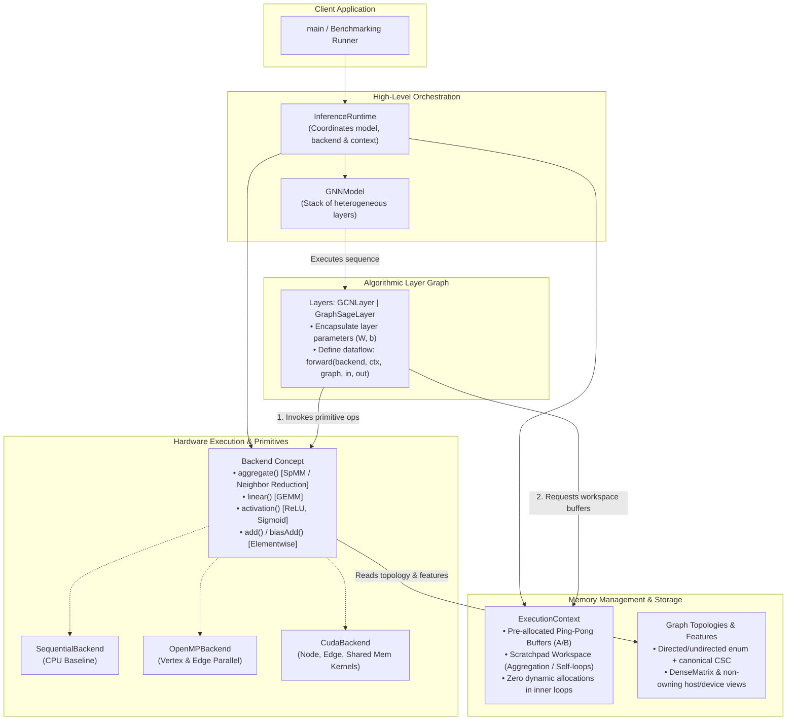

# Graph Neural Network Inference Engine on CPUs and GPUs

[](https://en.cppreference.com/w/cpp/20)
[](https://developer.nvidia.com/cuda-toolkit)
[](https://mesonbuild.com/)
[](LICENSE)

A high-performance, modular full-batch Graph Neural Network (GNN) inference engine implemented from scratch in **C++20**, **OpenMP**, and **CUDA**. It evaluates sequential CPU, multi-core CPU, and NVIDIA GPU execution for GCN and GraphSAGE workloads.

---

## 1. Architectural Overview

The engine adopts a **fully decoupled, modular architecture** that cleanly separates **algorithmic layer logic**, **hardware execution primitives**, and **memory lifecycle management**. This avoids monolithic dispatch engines, eliminates $M \times N$ code duplication, and enables zero-allocation inference loops.

> 📖 **Full Architectural Specification**: See [doc/architecture.md](doc/architecture.md) for in-depth concepts, diagrams, and memory management details.



### Core Architecture Pillars

1. **`Backend` (Hardware Compute Primitives)**: Exposes pure hardware math operations (`aggregate`, `linear`, `activation`, `add`, `biasAdd`). Backends: `SequentialBackend`, `OpenMPBackend`, `CudaBackend`.
2. **`ExecutionContext` (Memory & Buffer Management)**: Manages pre-allocated ping-pong buffers (`bufferA`, `bufferB`) and scratchpad workspaces to eliminate dynamic heap allocations during inference.
3. **`Layer` (Algorithmic Logic)**: Encapsulates parameters ($W_{\text{neigh}}, W_{\text{self}}, b$) and defines `forward(backend, ctx, graph, in, out)` by composing backend primitives.
4. **`GNNModel` (Layer Pipeline Container)**: Holds an ordered sequence of heterogeneous layers and orchestrates multi-layer forward propagation.
5. **`InferenceRuntime` (Execution Orchestrator)**: High-level engine binding the Model, Backend, and Context, exposing `.run(graph, features)`.

---

## 2. Project Documentation

| Document | Description |
| :--- | :--- |
| [Documentation](doc/documentation_summary.md) | Implementation and design choices summarized in order to meet the derivables requirements. |
| [Modular Architecture Specification](doc/architecture.md) | In-depth technical specification of the 5-pillar architecture, C++20 concepts, and memory models. |
| [Original Project Specification](doc/project.md) | Official course problem definition, required deliverables, and background. |
| [Requirements Document](doc/requirements.md) | Functional, non-functional, architectural, and performance requirements. |
| [Features Specification](doc/features.md) | Granular catalog of all implementable features across all engine components. |
| [Semantic Contract](doc/semantics.md) | Exact GCN/GraphSAGE mathematics, graph conventions, and selected parallel mappings. |
| [Environment Setup Instructions](doc/environment.md) | Setup guide for Windows (MSYS2 UCRT64), Linux, WSL, and Google Colab. |
| [GNN & Graph Knowledge Base](doc/knowledge.md) | Mathematical formulation of GCN/GraphSAGE and sparse graph storage (CSR/CSC). |


---

## 3. Build & Execution Instructions

### Prerequisites

- **C++ Compiler**: GCC 11+ / Clang 14+ supporting C++20.
- **Build System**: [Meson](https://mesonbuild.com/) (>= 0.60) and [Ninja](https://ninja-build.org/).
- **OpenMP**: For multi-core CPU parallel execution.
- **CUDA Toolkit** (Optional / Linux): For GPU targets (`nvcc`).
- **Python** : Python 3.8+, recommended for helper scripts, possible used packages numpy, scipy, networkit, ogb (if converting OGB datasets)

### Quick Start

```bash
# 0. Create the Python tooling environment
uv sync

# 1. Configure build directory
meson setup builddir

# 2. Compile targets
meson compile -C builddir

# 3. Format and statically analyze the source (Ninja backend)
ninja -C builddir clang-format
ninja -C builddir clang-tidy

# 4. Run one of the modes exposed by the single CLI
./builddir/gnn sequential
./builddir/gnn parallel
./builddir/gnn cuda
```

To run the current demo with generated or downloaded data, pass the graph and node-feature
files produced by the scripts:

```bash
./builddir/gnn sequential synth_data/graph.bin_graph synth_data/graph_feats.bin_matrix
./builddir/gnn parallel synth_data/graph.bin_graph synth_data/graph_feats.bin_matrix
./builddir/gnn cuda synth_data/graph.bin_graph synth_data/graph_feats.bin_matrix
```

The loader validates the CSC topology and checks that the feature row count matches the number of
nodes. Since trained model-parameter import is not implemented yet, this path creates a one-layer
projection model matching the loaded feature width and prints a preview of its output. Node and edge
features remain separate execution matrices rather than members of the graph object.

The `clang-format` and `clang-tidy` targets are generated automatically by
Meson when the corresponding tools and project configuration files are
available (`.clang-format` and `.clang-tidy`).

The sequential mode is always available. The `parallel` and `cuda` modes are
listed by `gnn --help` only when OpenMP and CUDA, respectively, were detected
while configuring the build.

For detailed cross-platform environment setup (including Windows MSYS2 UCRT64 and Google Colab workflows), see [doc/environment.md](doc/environment.md).

---
## 4. Execution parameters

```
Usage: gnn --backend MODE [options]
Modes: sequential parallel cuda   (parallel/cuda only listed if OpenMP/CUDA were found at build time)
```

`--backend MODE` (optional, default: `sequential`)

- `sequential` — Single-threaded CPU run
- `parallel` — Multi-threaded CPU (OpenMP) — only available if OpenMP was found at build time
- `cuda` — CUDA GPU run — only available if CUDA (`nvcc`) was found at build time

Data options — `--graph`, `--features`, and `--model` are **required together**; if any one of the three is missing, the program ignores all three and runs the built-in two-node demo instead:

- `--graph FILE` — binary graph topology in the repository's custom `.bin_graph` format
- `--features FILE` — binary dense node-feature matrix in the custom `.bin_matrix` format
- `--model FILE` — model description manifest (layer types, activations, weight/bias file paths); see `src/common/data/model_io.hpp` for the exact manifest format. No script in `scripts/` currently generates this manifest — `--graph`/`--features`/`--model` today have to be produced/authored manually to match that loader.

Other options:

- `--help`, `-h` — show CLI usage and exit
- `--output CSV` — path for the machine-readable benchmark results; omit to skip CSV export
- `--embeddings FILE` — path to write the final output embedding matrix; omit to skip
- `--warmups N` — unmeasured warm-up iterations before timing (default: `1`)
- `--repetitions N` — number of measured iterations (default: `10`)
- `--threads N` — OpenMP worker threads, only used by `--backend parallel` (default: `1`)
- `--block-size N` — CUDA threads per block, only used by `--backend cuda` (default: `256`)

**Runtime behaviour to take into account**:

- With no `--graph`/`--features`/`--model` (or with a partial set of the three), the program runs the built-in demo and prints `running demo`.
- If the loaded feature matrix's row count does not match the graph's node count, execution aborts with an error.
- The program prints the mean/stddev compute time and a preview of the result matrix to stdout.

Environment variables that affect execution:

- `OMP_NUM_THREADS` — controls CPU-thread count for OpenMP (used together with `--threads` for `--backend parallel`)
- `CUDA_VISIBLE_DEVICES` — controls which GPUs are visible to the process (useful for `--backend cuda`)

Examples:

- Run built-in demo (no data paths):
```bash
./builddir/gnn --backend sequential
```

- Run with custom data:
```bash
./builddir/gnn --backend cuda --graph path/to/graph.bin_graph --features path/to/features.bin_matrix --model path/to/model.manifest
```

- Run parallel mode with 16 threads:
```bash
export OMP_NUM_THREADS=16
./builddir/gnn --backend parallel --threads 16 --graph path/to/graph.bin_graph --features path/to/features.bin_matrix --model path/to/model.manifest
```

- Export benchmark results and the output embeddings:
```bash
./builddir/gnn --backend sequential --graph g.bin_graph --features f.bin_matrix --model m.manifest --output results.csv --embeddings out.bin_matrix --warmups 3 --repetitions 20
```

---

## 5. Dataset formats 

The project uses two custom binary formats consumed by `graph::GraphLoader`:

### Graph file: `.bin_graph` (single binary file)

Layout (in byte order little-endian; header format must match Python struct `'<QQBB'`):

1. GraphHeader (packed, total 18 bytes)
   - `uint64_t numNodes` (8 bytes)  
   - `uint64_t numEdges` (8 bytes)  
   - `uint8_t  isDirected` (1 byte) — `0` or `1`  
   - `uint8_t  hasWeights` (1 byte) — `0` or `1`

2. `colPtr` — array of `uint64_t` of length `numNodes + 1` (column/CSR pointer array)  
3. `rowInd` — array of `uint64_t` of length `numEdges` (destination row indices / flattened edges)  
4. `weights` — (optional) array of `float` (IEEE 754 float32) of length `numEdges` — present only if `hasWeights` is 1

Notes:

- The code reads header with `readExact`, then reads `colPtr` and `rowInd` as `uint64_t`.  
- `colPtr` count is computed as `numNodes + 1`.  
- The `GraphHeader` `static_assert` enforces the layout matches Python `'<QQBB'`. Use little-endian writes from Python or tools.  
- The loader returns a `HostGraphCSC` (CSC orientation used internally — but the header/arrays are what the loader expects).  

### Dense matrix file: `.bin_matrix` (used for node features)

Layout (little-endian):

1. `uint64_t rows` (8 bytes)  
2. `uint64_t cols` (8 bytes)  
3. `rows * cols` floats (IEEE 754 float32) in row-major order

Notes:

- The loader reads `rows`, `cols` and then reads exactly `rows*cols` floats into the internal `Matrix<HostBuffer<float>>`.  

## 6. Three-Person Workload Division

The project uses one shared-infrastructure stream and two vertical model streams. All three members write parallel code: `s362415` takes GCN through OpenMP and CUDA, `s296248` does the same for GraphSAGE, and `s360540` implements the common OpenMP/CUDA infrastructure and primitives.

The statuses below combine project-level progress with an audit of the current branch against the
acceptance criteria in [`doc/features.md`](doc/features.md). `Completed`
means the work is integrated in this branch; `Completed — pending merge` means it was completed on
another branch and still needs to be merged; `Scheduled` means implementation has started but is
incomplete; `Assigned` means implementation has not started.

| Task ID(s) | Task | Student ID | Status |
| :--- | :--- | :---: | :---: |
| T-CON-01 | Directed/undirected canonical CSC graph representation and orientation enum | `s360540` | Completed |
| T-CON-03–T-CON-04 | GCN/GraphSAGE layer descriptors and generic model definition | `s360540` | Completed |
| T-IO-02 | Canonical graph loader and orientation validation | `s362415` | Completed |
| T-DATA-01 | Reproducible synthetic graph generator | `s362415` | Completed |
| T-DATA-03 | Public dataset preparation | `s362415` | Completed |
| T-CON-02 | Storage-generic buffers, matrices, graphs, and CUDA kernel views | `s360540` | Scheduled |
| T-CON-06–T-CON-08 | Executor contracts, reusable workspaces, and outer backend dispatch | `s360540` | Scheduled |
| T-CON-05 (GCN) | GCN degree and self-message semantic preparation | `s362415` | Completed — pending merge |
| T-CON-05 (GraphSAGE) | GraphSAGE neighbor-total semantic preparation | `s296248` | Assigned |
| T-IO-01, T-IO-05 | Versioned workload bundle and machine-readable result schema | `s360540` | Assigned |
| T-IO-03 | Feature, model, layer, and parameter loading | `s362415s` | Completed |
| T-IO-04, T-IO-06 | CLI configuration and unsupported-composition validation | `s360540` | Scheduled |
| T-SEQ-01 | Shared sequential dense, bias, activation, and branch-combination primitives | `s360540` | Scheduled |
| T-SEQ-05 | Generic model execution with layer iteration and ping-pong buffers | `s360540` | Completed |
| T-SEQ-06 | Allocation-free steady-state workspace reuse | `s360540` | Scheduled |
| T-SEQ-02 | Sequential GCN normalized aggregation | `s362415` | Completed - pending merge |
| T-SEQ-04 (GCN) | Sequential GCN layer execution | `s362415` | Completed - pending merge |
| T-SEQ-03 | Sequential GraphSAGE weighted non-self mean | `s296248` | Assigned |
| T-SEQ-04 (GraphSAGE) | Sequential GraphSAGE layer execution | `s296248` | Scheduled |
| T-VER-03, T-VER-05 | Common comparison and invalid-input test infrastructure | `s360540` | Assigned |
| T-VER-01, T-VER-04/T-VER-06 (GCN) | GCN fixtures and native/framework backend verification | `s362415` | Completed |
| T-VER-02, T-VER-04/T-VER-06 (GraphSAGE) | GraphSAGE fixtures and native/framework backend verification | `s296248` | Assigned |
| T-OMPV-03, T-OMPV-05 | Common OpenMP dense/elementwise operations and workspace | `s360540` | Scheduled |
| T-OMPV-01, T-OMPV-04 (GCN) | Destination-owned OpenMP GCN and its configurations | `s362415` | Completed - pending merge |
| T-OMPV-02, T-OMPV-04 (GraphSAGE) | Destination-owned OpenMP GraphSAGE and its configurations | `s296248` | Assigned |
| T-OMPE-01–T-OMPE-05 | Conditional additional OpenMP mapping | `s296248` | Assigned |
| T-CUDA-01–T-CUDA-04, T-CUDAV-03 | CUDA ownership/runtime and common CUDA operations | `s360540` | Scheduled |
| T-CUDAV-01, T-CUDAV-04 (GCN) | CUDA GCN aggregation and launch configurations | `s362415` | Completed |
| T-CUDAV-02, T-CUDAV-04 (GraphSAGE) | CUDA GraphSAGE aggregation and launch configurations | `s296248` | Assigned |
| T-CUDAA-01–T-CUDAA-04 | Conditional additional CUDA mapping | `s296248` | Assigned |
| T-EXP-01–T-EXP-03 | Shared-memory and sparse/dense studies | `s296248` | Assigned |
| T-DATA-02, T-DATA-04/T-DATA-05 (GCN) | Synthetic workload ranges and GCN parameters/counts | `s362415` | Completed |
| T-DATA-04/T-DATA-05 (GraphSAGE) | GraphSAGE parameters/counts | `s296248` | Assigned |
| T-FRM-01, T-FRM-02, T-FRM-05 | Shared external-framework adapter and measurement boundaries | `s360540` | Assigned |
| T-FRM-03, T-FRM-06 (GCN) | GCN framework mapping and comparison | `s362415` | Assigned |
| T-FRM-04, T-FRM-06 (GraphSAGE) | GraphSAGE framework mapping and comparison | `s296248` | Assigned |
| T-BENCH-01, T-BENCH-02, T-BENCH-07 | Common benchmark runner, timing boundaries, and metadata | `s360540` | Assigned |
| T-BENCH-03–T-BENCH-06 (OpenMP/GCN) | OpenMP scaling and GCN benchmark results | `s362415` | Assigned |
| T-BENCH-03–T-BENCH-06 (CUDA/GraphSAGE) | CUDA configurations, memory, and GraphSAGE benchmark results | `s296248` | Assigned |
| T-DEL-01–T-DEL-02 | Build, CLI, bundle, and run documentation | `s360540` | Scheduled |
| T-DEL-03–T-DEL-04 (GCN/OpenMP) | GCN/OpenMP plots and report sections | `s362415` | Assigned |
| T-DEL-03–T-DEL-05 (GraphSAGE/CUDA) | GraphSAGE/CUDA report sections and demonstration | `s296248` | Assigned |

Detailed acceptance criteria for every task are in [doc/features.md](doc/features.md#61-three-person-delivery-split).

---

## 7. License

This project is licensed under the European Union Public Licence (EUPL-1.2) - see the [LICENSE](LICENSE) file for details.
