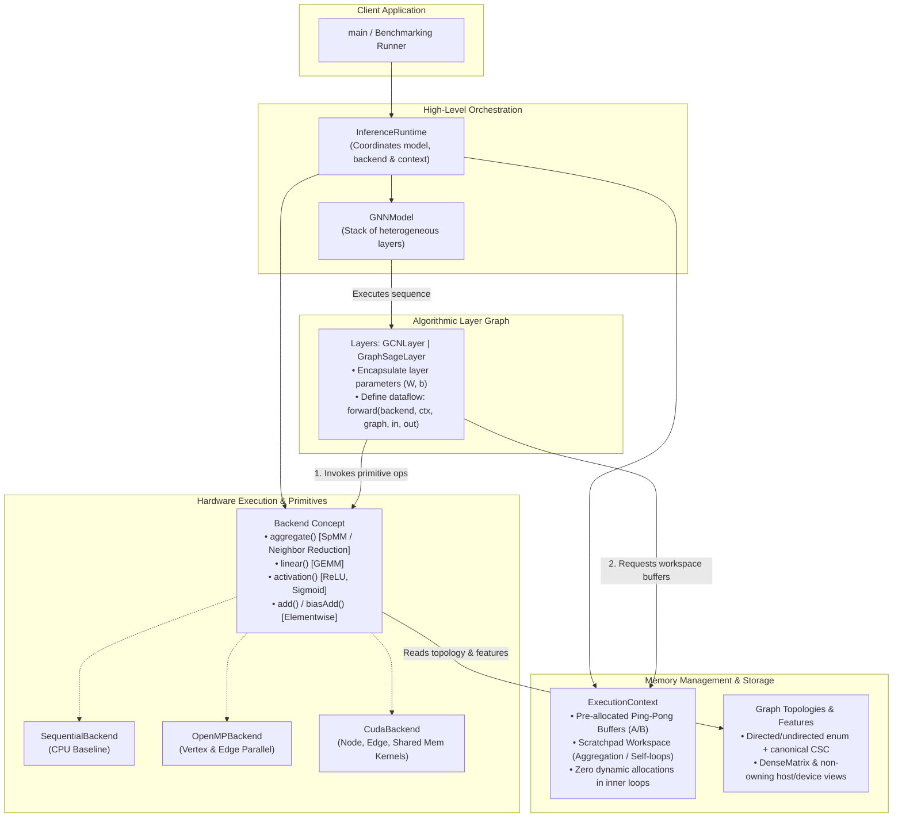

# Graph Neural Network Inference Engine on CPUs and GPUs

[](https://en.cppreference.com/w/cpp/20)
[](https://developer.nvidia.com/cuda-toolkit)
[](https://mesonbuild.com/)
[](LICENSE)

A high-performance, modular full-batch Graph Neural Network (GNN) inference engine implemented from scratch in **C++20**, **OpenMP**, and **CUDA**. It evaluates sequential CPU, multi-core CPU, and NVIDIA GPU execution for GCN and GraphSAGE workloads.

---

## 1. Architectural Overview

The engine adopts a **fully decoupled, modular architecture** that cleanly separates **algorithmic layer logic**, **hardware execution primitives**, and **memory lifecycle management**. This avoids monolithic dispatch engines, eliminates $M \times N$ code duplication, and enables zero-allocation inference loops.

> 📖 **Full Architectural Specification**: See [doc/architecture.md](doc/architecture.md) for in-depth concepts, diagrams, and memory management details.



### Core Architecture Pillars

1. **`Backend` (Hardware Compute Primitives)**: Exposes pure hardware math operations (`aggregate`, `linear`, `activation`, `add`, `biasAdd`). Backends: `SequentialBackend`, `OpenMPBackend`, `CudaBackend`.
2. **`ExecutionContext` (Memory & Buffer Management)**: Manages pre-allocated ping-pong buffers (`bufferA`, `bufferB`) and scratchpad workspaces to eliminate dynamic heap allocations during inference.
3. **`Layer` (Algorithmic Logic)**: Encapsulates parameters ($W_{\text{neigh}}, W_{\text{self}}, b$) and defines `forward(backend, ctx, graph, in, out)` by composing backend primitives.
4. **`GNNModel` (Layer Pipeline Container)**: Holds an ordered sequence of heterogeneous layers and orchestrates multi-layer forward propagation.
5. **`InferenceRuntime` (Execution Orchestrator)**: High-level engine binding the Model, Backend, and Context, exposing `.run(graph, features)`.

---

## 2. Project Documentation

| Document | Description |
| :--- | :--- |
| [Modular Architecture Specification](doc/architecture.md) | In-depth technical specification of the 5-pillar architecture, C++20 concepts, and memory models. |
| [Original Project Specification](doc/project.md) | Official course problem definition, required deliverables, and background. |
| [Requirements Document](doc/requirements.md) | Functional, non-functional, architectural, and performance requirements. |
| [Features Specification](doc/features.md) | Granular catalog of all implementable features across all engine components. |
| [Semantic Contract](doc/semantics.md) | Exact GCN/GraphSAGE mathematics, graph conventions, and selected parallel mappings. |
| [Environment Setup Instructions](doc/environment.md) | Setup guide for Windows (MSYS2 UCRT64), Linux, WSL, and Google Colab. |
| [GNN & Graph Knowledge Base](doc/knowledge.md) | Mathematical formulation of GCN/GraphSAGE and sparse graph storage (CSR/CSC). |

---

## 3. Three-Person Workload Division

The project uses one shared-infrastructure stream and two vertical model streams. All three members write parallel code: `s362415` takes GCN through OpenMP and CUDA, `s296248` does the same for GraphSAGE, and `s360540` implements the common OpenMP/CUDA infrastructure and primitives.

The status values below are the agreed planning snapshot; they intentionally do not infer progress from the current source tree. Only graph representation, model/layer definitions, graph generation, and graph loading are marked completed. Every other task is marked assigned.

| Task ID(s) | Task | Student ID | Status |
| :--- | :--- | :---: | :---: |
| T-CON-01 | Directed/undirected canonical CSC graph representation and orientation enum | `s360540` | Completed |
| T-CON-03–T-CON-04 | GCN/GraphSAGE layer descriptors and generic model definition | `s360540` | Completed |
| T-IO-02 | Canonical graph loader and orientation validation | `s362415` | Completed |
| T-DATA-01 | Reproducible synthetic graph generator | `s362415` | Completed |
| T-CON-02, T-CON-06–T-CON-08 | Matrix/views, executor contracts, workspaces, and dispatch | `s360540` | Assigned |
| T-CON-05 (GCN) | GCN degree and self-message semantic preparation | `s362415` | Assigned |
| T-CON-05 (GraphSAGE) | GraphSAGE neighbor-total semantic preparation | `s296248` | Assigned |
| T-IO-01, T-IO-03–T-IO-06 | Bundle, feature/model/parameter loading, CLI, results, and validation | `s360540` | Assigned |
| T-SEQ-01, T-SEQ-05–T-SEQ-06 | Shared sequential primitives, model execution, and workspace reuse | `s360540` | Assigned |
| T-SEQ-02, T-SEQ-04 (GCN) | Sequential GCN aggregation and layer execution | `s362415` | Assigned |
| T-SEQ-03, T-SEQ-04 (GraphSAGE) | Sequential GraphSAGE aggregation and layer execution | `s296248` | Assigned |
| T-VER-03, T-VER-05 | Common comparison and invalid-input test infrastructure | `s360540` | Assigned |
| T-VER-01, T-VER-04/T-VER-06 (GCN) | GCN fixtures and native/framework backend verification | `s362415` | Assigned |
| T-VER-02, T-VER-04/T-VER-06 (GraphSAGE) | GraphSAGE fixtures and native/framework backend verification | `s296248` | Assigned |
| T-OMPV-03, T-OMPV-05 | Common OpenMP dense/elementwise operations and workspace | `s360540` | Assigned |
| T-OMPV-01, T-OMPV-04 (GCN) | Destination-owned OpenMP GCN and its configurations | `s362415` | Assigned |
| T-OMPV-02, T-OMPV-04 (GraphSAGE) | Destination-owned OpenMP GraphSAGE and its configurations | `s296248` | Assigned |
| T-OMPE-01–T-OMPE-05 | Conditional additional OpenMP mapping | `s362415` | Assigned |
| T-CUDA-01–T-CUDA-04, T-CUDAV-03 | CUDA ownership/runtime and common CUDA operations | `s360540` | Assigned |
| T-CUDAV-01, T-CUDAV-04 (GCN) | CUDA GCN aggregation and launch configurations | `s362415` | Assigned |
| T-CUDAV-02, T-CUDAV-04 (GraphSAGE) | CUDA GraphSAGE aggregation and launch configurations | `s296248` | Assigned |
| T-CUDAA-01–T-CUDAA-04 | Conditional additional CUDA mapping | `s296248` | Assigned |
| T-EXP-01–T-EXP-03 | Shared-memory and sparse/dense studies | `s296248` | Assigned |
| T-DATA-02, T-DATA-04/T-DATA-05 (GCN) | Synthetic workload ranges and GCN parameters/counts | `s362415` | Assigned |
| T-DATA-03, T-DATA-04/T-DATA-05 (GraphSAGE) | Public dataset preparation and GraphSAGE parameters/counts | `s296248` | Assigned |
| T-FRM-01, T-FRM-02, T-FRM-05 | Shared external-framework adapter and measurement boundaries | `s360540` | Assigned |
| T-FRM-03, T-FRM-06 (GCN) | GCN framework mapping and comparison | `s362415` | Assigned |
| T-FRM-04, T-FRM-06 (GraphSAGE) | GraphSAGE framework mapping and comparison | `s296248` | Assigned |
| T-BENCH-01, T-BENCH-02, T-BENCH-07 | Common benchmark runner, timing boundaries, and metadata | `s360540` | Assigned |
| T-BENCH-03–T-BENCH-06 (OpenMP/GCN) | OpenMP scaling and GCN benchmark results | `s362415` | Assigned |
| T-BENCH-03–T-BENCH-06 (CUDA/GraphSAGE) | CUDA configurations, memory, and GraphSAGE benchmark results | `s296248` | Assigned |
| T-DEL-01–T-DEL-02 | Build, CLI, bundle, and run documentation | `s360540` | Assigned |
| T-DEL-03–T-DEL-04 (GCN/OpenMP) | GCN/OpenMP plots and report sections | `s362415` | Assigned |
| T-DEL-03–T-DEL-05 (GraphSAGE/CUDA) | GraphSAGE/CUDA report sections and demonstration | `s296248` | Assigned |

Detailed acceptance criteria for every task are in [doc/features.md](doc/features.md#61-three-person-delivery-split).

---

## 4. Build & Execution Instructions

### Prerequisites

- **C++ Compiler**: GCC 11+ / Clang 14+ supporting C++20.
- **Build System**: [Meson](https://mesonbuild.com/) (>= 0.60) and [Ninja](https://ninja-build.org/).
- **OpenMP**: For multi-core CPU parallel execution.
- **CUDA Toolkit** (Optional / Linux): For GPU targets (`nvcc`).

### Quick Start

```bash
# 1. Configure build directory
meson setup builddir

# 2. Compile targets
meson compile -C builddir

# 3. Run Sequential CPU target (Linux/macOS shell)
./builddir/gnn_seq

# 4. Run OpenMP Parallel CPU target
./builddir/gnn_omp

# 5. Run CUDA GPU target (if compiled on CUDA-enabled environment)
./builddir/gnn_cuda
```

For detailed cross-platform environment setup (including Windows MSYS2 UCRT64 and Google Colab workflows), see [doc/environment.md](doc/environment.md).

---

## 5. License

This project is licensed under the European Union Public Licence (EUPL-1.2) - see the [LICENSE](LICENSE) file for details.
