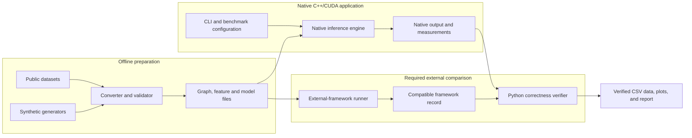
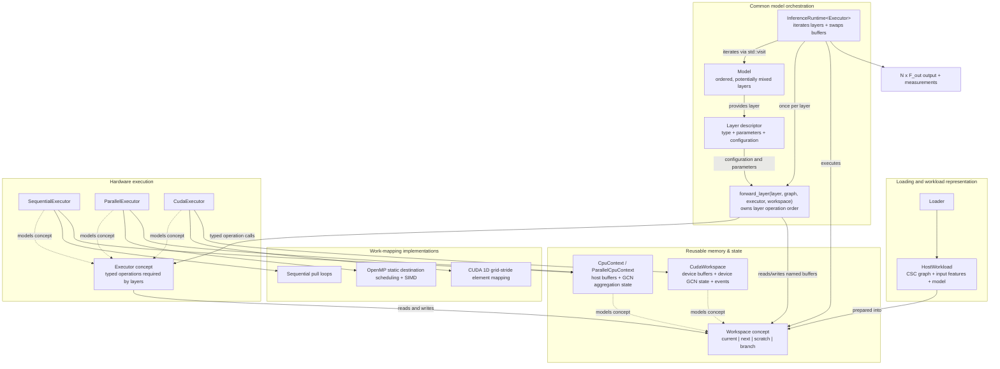

# Native C++/CUDA Architecture
## GNN inference on sequential CPUs, multi-core CPUs, and NVIDIA GPUs

## 1. Purpose

This document defines the target software architecture for the required project in [requirements.md](requirements.md). The selected GNNs, work mappings, and mathematical definitions are specified separately in [semantics.md](semantics.md).

The project is a native, inference-only benchmark application. Its purpose is to run equivalent full-batch workloads for the GNN types selected in [semantics.md](semantics.md) with:

- sequential C++;
- one or more OpenMP work mappings; and
- one or more CUDA work mappings.

The requirements prescribe the minimum implementation counts. The concrete GNN families and selected OpenMP/CUDA mappings come from `semantics.md`; this document explains how those choices fit the reusable component architecture.

The architecture separates layer-specific algorithms, hardware operations, work-mapping strategies, and memory ownership. These pieces are composed with ordinary C++20 templates/concepts and concrete types. The native engine does not require a general deep-learning framework, dependency-injection container, runtime inheritance hierarchy, or Python runtime dependency.

## 2. Scope boundary

### 2.1 Required native path

The measured engine consists of a C++ command-line program, common C++ data types, C++/OpenMP implementations, and CUDA implementations. It loads a graph, features, and fixed model parameters; validates them; runs inference; and emits results.

The core path must not call PyTorch, PyTorch Geometric, DGL, NumPy, or Python to execute a required GNN layer.

### 2.2 External tooling boundary

Dataset download and conversion, experiment sweeps, CSV analysis, and plotting run outside the native inference path. The required established-framework comparison runner is also a separate program. The native command-line interface and versioned files form the supported boundary between these tools and the engine.

Training, automatic differentiation, sampling, graph mutation during a run, distributed execution, and multi-GPU execution are also outside this architecture.

## 3. System context and data flow

This first diagram treats the native engine as one system. It shows where data originates, which work is outside the measured native program, and how native and external results meet. It intentionally hides C++ component details; those appear in Section 4.



Separate graph, feature and model files form the interoperability boundary. The native executable and external-framework runner consume equivalent topology, features, parameters, and model configuration, but they are separate programs. Offline conversion and framework execution are not dependencies of the native inference engine.

## 4. Native engine composition

This section is the normative home for model/layer orchestration, executor responsibilities, workspace ownership, and their extension boundaries. The next diagram opens the `Native inference engine` box and combines component relationships with control and data flow. Boxes labelled “concept” are compile-time requirements, not base classes and not runtime objects.



The principal composition is:

```text
InferenceRuntime<ConcreteExecutor>::run(workspace)
    -> forward_layer(concrete_layer, graph, executor, workspace)
        -> executor operations (rowByColumn, aggregateGCN, aggregateNeighbors, etc.)
            -> selected hardware execution (sequential, OpenMP static + SIMD, CUDA grid-stride)
                -> host or CUDA workspace buffers (current, next, scratch, branch)
```

The arrows do not mean that one monolithic executor owns the model algorithm. `InferenceRuntime::run` owns model iteration and buffer swapping. `forward_layer` owns the instructions and operation order for a specific layer type. The executor implements those operations for a hardware family without knowledge of the overarching model pipeline. The workspace owns reusable memory and backend-specific aggregation state.

### 4.1 Why the layer does not return a pipeline

A layer is a lightweight parameter and configuration container. The corresponding `forward_layer` overload is its executable algorithm. For GCN:

```cpp
template <Executor E, typename WeightMatrix, typename BiasStorage, typename Graph>
void forward_layer(const GCNLayer<WeightMatrix, BiasStorage>& layer,
                   const Graph& graph,
                   E& executor,
                   typename E::WorkspaceType& workspace) {
    executor.rowByColumn(workspace.current(), layer.getWNeigh(), workspace.scratch());
    executor.aggregateGCN(graph, workspace.scratch(), workspace.getGCNState(), workspace.next());
    if (layer.hasBias())
        executor.biasAdd(workspace.next(), layer.getBias());
    if (layer.getActType() == GCNActivationType::RELU)
        executor.relu(workspace.next());
}
```

This typed C++ control flow is the pipeline. The layer does not allocate and return a command list, graph, or type-erased pipeline object. Avoiding such an intermediate object preserves compile-time checking and lets CUDA executor calls enqueue kernels without adding per-operation runtime dispatch.

For mean GraphSAGE, `forward_layer` executes neighbor aggregation into `workspace.scratch()`, performs neighbor linear transformation into `workspace.next()`, transforms current features through the optional self-branch into `workspace.branch()`, combines branches with element-wise addition, and applies optional bias and activation.

Every supported layer type receives a `forward_layer` overload describing its operation sequence. A model may therefore contain, for example, `GCN -> GraphSAGE -> GCN`, provided adjacent feature dimensions match and the selected executor supports every layer.

Heterogeneous layer storage is handled with `std::variant`. Dispatch occurs at most once per graph-wide layer via `std::visit` in `InferenceRuntime::run`. No virtual call, type switch, or string lookup occurs inside node, edge, or feature loops.

### 4.2 Responsibility summary

| Component | Owns | Does not own |
| --- | --- | --- |
| `HostWorkload` | Validated graph, input features, and fixed model | Execution buffers, device memory, or backend policies |
| `Model` / layer descriptors | Ordered layer types, parameters, dimensions, and configuration | CPU threads, CUDA launches, scratch allocation |
| `InferenceRuntime` | Layer iteration via `std::visit` and current/next buffer swapping | Layer-specific mathematics or work mapping |
| `forward_layer` | Instructions and operation order for that layer type | Hardware loops, kernel launches, buffer allocation |
| `Executor` | Hardware implementation of typed operations (`rowByColumn`, `aggregateGCN`, `aggregateNeighbors`, `add`, `biasAdd`, `relu`) | Model/layer semantics or pipeline sequencing |
| Work-mapping policy | Concrete thread/block loop or kernel partitioning within each executor | Layer sequence or parameter ownership |
| `Workspace` | Reusable host/device feature buffers (`current`, `next`, `scratch`, `branch`) and backend GCN aggregation state | Mathematical decisions or model iteration |
| Backend runners (`run_sequential`, `run_parallel`, `run_cuda`) | CLI argument parsing, setup, timing boundaries, warmup/repetition loops, and output recording | Layer algorithms or executor inner loops |

## 5. Preparation and selection terminology

The high-level diagram retains three concise labels. In this architecture they have precise, limited meanings:

| Label | Exact responsibility |
| --- | --- |
| Semantic preparation | Compute immutable layer-specific metadata required by aggregation, such as GCN degrees, inverse square roots, and self-loop flags. This is encapsulated within the workspace's aggregation state (`GCNAggregationState` / `CudaGCNAggregationState`) and prepared once per workload. |
| Host workload | Immutable validated host-side graph (`HostGraphCSC`), input features (`HostMatrix`), and model definition (`HostModel`). It does not hold backend execution buffers or device state. |
| Backend dispatch | The outer program startup selection based on CLI arguments (`--backend sequential|parallel|cuda`) dispatching to the appropriate backend runner and concrete executor/workspace composition. |

CUDA allocation/upload and host workspace reservation happen after this selection when the concrete workspace is constructed. They are execution setup, not semantic preparation.

## 6. Shared native data contract

All executor compositions consume logically identical graph, feature, and model values. The common C++ layer owns these values and performs validation once before execution.

### 6.1 Graph

The canonical required representation is incoming-neighbor CSC:

- `N` nodes have contiguous IDs in `[0, N)`;
- `col_ptr` has `N + 1` entries;
- the incoming sources for destination `v` are stored in `row_ind[col_ptr[v]..col_ptr[v+1])`;
- an optional scalar weight array is aligned one-to-one with `row_ind`;
- absent weights mean weight `1.0f`, while stored weights are finite and strictly positive;
- source IDs inside a column are strictly increasing; and
- duplicate ordered pairs are rejected during validation.

The graph is immutable during an inference run. CSC is used because the sequential and vertex-centric paths pull all incoming messages for one destination and can own that destination's output row without synchronization.

Graph storage uses `graph::GraphCSC<IndexStorage, WeightStorage>` (`HostGraphCSC` on CPU, device graph on CUDA). Both directed and undirected graphs are supported, distinguished by `isDirected()`. Both use the same CSC incoming-neighbor traversal contract; the undirected case adds reciprocal-edge and weight equality validation via `GraphFactory::validate`. Layers consume the common graph interface and do not branch on orientation. Regardless of the orientation flag, an adjacency entry always means `source -> destination`.

### 6.2 Dense matrices

Node features, intermediate features, weights, biases, and outputs use `float32`. Dense node and parameter matrices use row-major storage through `gnn::Matrix<Storage>`:

```text
element(row, column) = data[row * number_of_columns + column]
```

The input feature matrix has shape `N x F_in`. Layer `l` owns the parameter matrix or matrices required by its semantic contract, each with input/output dimensions compatible with `F_l` and `F_(l+1)`, plus an optional bias of length `F_(l+1)`. The final result has shape `N x F_out`.

On the host, `Matrix<HostBuffer<float>>` uses `HostBuffer<T>` with RAII heap ownership. On CUDA, `Matrix<DeviceBuffer<float>>` uses `DeviceBuffer<T>` non-owning views over device memory owned by `cuda::Allocation`. Reusable workspace matrices allow adjusting logical dimensions via `setShape(rows, cols)` within preallocated physical capacity without reallocation.

### 6.3 Generic model and mixed layers

`Model<Layers...>` is an ordered, non-empty collection of layer descriptors stored as `std::variant<Layers...>`. Layers may all have the same type or may be mixed. Each descriptor contains the fixed parameters and configuration required by its layer algorithm, including its input and output dimensions.

For example, each `GCNLayer` contains:

- input and output dimensions;
- neighbor weight matrix (`W_neigh`);
- optional bias; and
- activation (`NONE` or `RELU`).

Each `GraphSAGELayer` similarly contains its input/output dimensions, neighbor weight matrix (`W_neigh`), optional self weight matrix (`W_self`), optional bias, aggregation mode (`MEAN`, `SUM`, `MAX`), and activation (`NONE` or `RELU`).

A mixed model such as `GCN -> GraphSAGE -> GCN` is structurally valid when:

- every layer type has a corresponding `forward_layer` algorithm;
- the output dimension of layer `l` equals the input dimension of layer `l + 1`;
- the graph contains any data required by every layer;
- the selected executor models every capability required by those algorithms; and
- the selected workspace provides the scratch and branch capacity required across all layers.

Compatibility is checked during model construction and workload validation. An unsupported layer/executor combination produces a diagnostic rather than failing during a layer.

The selected model types are GCN and mean-aggregator GraphSAGE, as recorded in `semantics.md`. Both execute through the sequential, OpenMP, and CUDA executor families.

### 6.4 Prepared semantic metadata

Before a run, workspace preparation computes immutable values required by the model's layer algorithms. For GCN layers these values include:

- incoming degree normalization factors $1 / \sqrt{\tilde{d}_v}$ where $\tilde{d}_v$ accounts for explicit or implicit self-loops; and
- explicit self-loop flags per node (`hasExplicitSelfLoop`).

On CPU, this metadata preparation is performed by `GCNAggregationState` (sequential) or `GCNAggregationStateParallel` (OpenMP). On CUDA, it is computed directly on the GPU via `launchGcnPrepareMetadata` (`gcnPrepareMetadataKernel`), avoiding host-side derivation and extra transfer overhead. The derived metadata is stored in the workspace's GCN aggregation state and reused across repetitions.

For mean GraphSAGE, neighborhood traversal excludes self entries ($u == v$) on the fly, computing the non-self incoming mean or producing zero for isolated nodes.

### 6.5 Logical input and output

The architecture uses simple value records rather than a large runtime object graph. The following structures represent the key data boundaries:

```cpp
struct HostWorkload {
    graph::HostGraphCSC graph;
    layers::HostMatrix input;
    HostModel model;
};

struct RunOptions {
    std::string backend = "sequential"; // "sequential", "parallel", "cuda"
    std::string graph;                  // Graph topology binary path
    std::string features;               // Node-feature matrix path
    std::string model;                  // Model manifest path
    std::string output;                 // Benchmark CSV path
    std::string embeddings;             // Final output embedding matrix path
    int threads = 1;                    // OpenMP worker threads
    int blockSize = 256;                // CUDA block size
    int warmups = 1;                    // Warmup iterations
    int repetitions = 10;               // Measured repetitions
};

struct Measurements {
    std::vector<Sample> samples;        // Individual run timing samples
    double meanMs = 0;
    double stddevMs = 0;
};
```

This sketch is a responsibility map, not a requirement to use these exact names or place every field in one struct.

## 7. Native program lifecycle

The executable follows a visible, testable sequence:

1. Parse CLI options: `--backend sequential|parallel|cuda`, `--graph`, `--features`, `--model`, `--warmups`, `--repetitions`, `--output`, `--embeddings`, OpenMP `--threads`, and CUDA `--block-size`. When graph, features, or model paths are omitted, the program runs the built-in demo workload (`demo::makeCpuDemo()`).
2. Dispatch to the selected backend runner function: `run_sequential`, `run_parallel`, or `run_cuda`.
3. Load the workload: read the binary CSC graph, dense node-feature matrix, and model manifest into `HostWorkload`.
4. Prepare the workspace (`workspace.prepare(workload)`): validate graph/feature/model consistency, preallocate four working buffers (`current`, `next`, `scratch`, `branch`) sized to `N x maximumFeatureWidth(model)`, precompute backend GCN aggregation metadata (`GCNAggregationState` on CPU or `CudaGCNAggregationState` on device), and upload graph/model/input data to the device for CUDA.
5. Perform warmup iterations outside measurement: restore input via `workspace.resetInput()`, execute inference via `runtime.run(workspace)`.
6. Perform repeated measured iterations: restore input (`reset_ms`), record start time, execute `runtime.run(workspace)`, synchronize and record compute duration (`compute_ms`).
7. Retrieve final output: borrow host matrix for CPU backends; download from device to host for CUDA (`download_ms`).
8. Emit results: record timing samples and statistics in benchmark CSV (`output`), optionally export binary embedding matrix (`embeddings`), and print demo preview if in demo mode.

### 7.1 Timing boundaries

Measurements distinguish distinct execution phases:

| Measurement | Meaning and Scope |
| --- | --- |
| `load_ms` | File I/O: reading graph binary, node feature matrix, and parsing model manifest |
| `setup_ms` | Workspace preparation: memory allocation, buffer sizing, and GCN metadata preparation (excluding device upload for CUDA) |
| `upload_ms` | Host-to-device transfers of graph, model weights, and initial features (isolated within CUDA workspace preparation; zero on CPU) |
| `reset_ms` | Per-repetition restoration of original input features into `workspace.current()` |
| `compute_ms` | Steady-state multi-layer forward pass (`runtime.run`); timed with `std::chrono::steady_clock` on CPU and CUDA events (`cudaEventRecord`, `cudaEventSynchronize`, `cudaEventElapsedTime`) on GPU |
| `download_ms` | Device-to-host transfer of the final embedding matrix (CUDA only; zero on CPU where output is borrowed in-place) |
| `end_to_end_ms` | Per-repetition total of input reset and compute iteration |

The benchmark runner records these distinct fields rather than hiding setup, upload, or download behind a single generic duration.

## 8. Multi-layer model execution

`InferenceRuntime<Executor>::run(workspace)` iterates through the model's layers and invokes the correct layer-specific `forward_layer` algorithm via `std::visit`. Each overload invokes typed executor operations but remains the owner of that layer's algorithmic sequence. After each layer, `workspace.swapBuffers()` exchanges `current` and `next`.

### 8.1 GCN layer execution

For GCN, `forward_layer` expresses the operation defined in [semantics.md](semantics.md):

1. Dense linear feature transformation: `executor.rowByColumn(workspace.current(), layer.getWNeigh(), workspace.scratch())`, computing $H^{(l)} W_{neigh} \to \text{scratch}$.
2. Degree-normalized aggregation: `executor.aggregateGCN(graph, workspace.scratch(), workspace.getGCNState(), workspace.next())`, pulling incoming neighbors and applying $\widehat{D}^{-1/2} \widehat{A} \widehat{D}^{-1/2} (\text{scratch}) \to \text{next}$.
3. Optional bias addition: `executor.biasAdd(workspace.next(), layer.getBias())`.
4. Optional activation: `executor.relu(workspace.next())` if activation is `RELU`.

Performing linear transformation before message aggregation is the selected order: it projects features into the layer's output dimension prior to neighbor accumulation and is recorded in benchmark metadata.

### 8.2 GraphSAGE layer execution

For mean GraphSAGE, `forward_layer` requests:

1. Neighbor aggregation: `executor.aggregateNeighbors(graph, workspace.current(), workspace.scratch(), layer.getAggType())`, computing a non-self incoming neighbor mean into scratch (producing zero for empty neighborhoods).
2. Neighbor linear transformation: `executor.rowByColumn(workspace.scratch(), layer.getWNeigh(), workspace.next())`.
3. Optional self-branch: `executor.rowByColumn(workspace.current(), layer.getWSelf(), workspace.branch())`, followed by branch combination via `executor.add(workspace.next(), workspace.branch(), workspace.next())`.
4. Optional bias addition and activation (`biasAdd`, `relu`).

Stored self-loops ($u == v$) are excluded from the neighbor mean on the fly during incoming CSC traversal, and GraphSAGE does not include GCN's implicit self-loop contribution.

### 8.3 Workspace use

The public interface is declared in the `Workspace` concept:
`prepare(workload)`, `resetInput()`, `getGraph()`, `getModel()`, `getOutput()`,
`current()`, `next()`, `scratch()`, `branch()`, `getGCNState()`, `swapBuffers()`, and `capacityBytes()`.
Allocation and transfer helpers are private. `prepare()` returns `WorkspacePreparation` containing upload timing metadata, allowing the runner to isolate upload from the rest of setup.

`CpuContext` and `ParallelCpuContext` borrow the immutable host workload and own their working buffers; the caller keeps the workload alive. `CudaWorkspace` uploads and owns the device representation.
`InferenceRuntime::run(workspace)` is the single execution entry point and only visits layers and swaps buffers. The separate backend runners prepare once, reset input before each measured run, and retrieve the output afterward. `getOutput()` returns a const reference on CPU and an owning host matrix downloaded on CUDA outside compute timing.

Four reusable feature buffers (`current`, `next`, `scratch`, `branch`) hold intermediate matrices. Their roles are swapped or reused across layers. Each workspace reserves capacity for `rows x maximumFeatureWidth(model)` before timed repetitions.

There is no full feature-matrix allocation, graph conversion, model reconstruction, or host/device round trip between layers in a timed steady-state run.

## 9. Concrete executor and strategy compositions

### 9.1 Sequential C++ baseline

`SequentialExecutor` models the required executor operations with ordinary single-threaded loops. `InferenceRuntime` owns the layer loop and buffer swaps. The sequential aggregation operation is direct and readable:

1. iterate destination nodes;
2. traverse each destination's CSC column;
3. accumulate incoming messages normalized by inverse square root degrees;
4. add an implicit self-loop contribution when an explicit self-loop is absent.

The executor's linear matrix product (`rowByColumn`), branch addition (`add`), and bias/activation operations use direct loops. For GraphSAGE, sequential aggregation excludes self entries ($u == v$), computes the non-self weighted mean, sum, or max, and allows combining separate self and neighbor branches. The sequential execution provides the native numerical baseline against which parallel and GPU results are verified.

### 9.2 Selected OpenMP destination-owned path

`ParallelExecutor` uses the common layer algorithms and `ParallelCpuContext` for both selected GNN types. Its aggregation strategy partitions destination nodes across threads using static loop scheduling (`#pragma omp parallel for schedule(static)`). A worker thread owns the aggregate/output row for each assigned destination, avoiding atomic aggregation writes.

Within neighbor aggregation, inner feature loops are vectorized with OpenMP SIMD pragmas (`#pragma omp simd`). Thread count is configured via `--threads`.

### 9.3 Optional additional OpenMP mappings

The destination-owned static mapping satisfies the required multi-threaded implementation count. Additional OpenMP mappings (such as dynamic/guided scheduling for skewed degree distributions or edge-centric partitioning with thread-local staging or atomic reduction) remain potential extensions that can model the same `Executor` concept without modifying layer algorithms.

### 9.4 CUDA memory and execution

Executor operations and kernel wrappers are declared in `cuda_executor.cuh`, `cuda_gcn_kernels.cuh`, and `cuda_GraphSAGE_kernels.cuh`, with kernel definitions in `cuda_kernels.cu`, `cuda_gcn_kernels.cu`, and `cuda_GraphSAGE_kernels.cu`. Kernels receive lightweight `Matrix<DeviceBuffer<float>>` and `DeviceBuffer<T>` handles by value, copying only raw pointers and shape metadata.

Device memory is managed by `CudaWorkspace` using RAII `cuda::Allocation` owners. CUDA workspace setup:

- allocates device buffers for CSC graph arrays, features, layer parameters, intermediates, and output;
- uploads immutable graph and model weights once;
- uploads the input feature matrix prior to execution;
- precomputes GCN normalization factors and self-loop flags on-device via `launchGcnPrepareMetadata`; and
- manages reusable workspace buffers and `cuda::Timer` events.

During steady-state inference, all layers execute device-resident, and `InferenceRuntime` swaps device buffer roles via pointer exchanges. Only the final output matrix is downloaded to host memory when required for consumption or verification.

### 9.5 Selected CUDA destination/feature path

`CudaExecutor` assigns destination/feature aggregation work through 1D grid-stride loops over output elements $(v, f)$, where destination node $v = index / featureDim$ and feature dimension $f = index \% featureDim$. Each thread pulls incoming edges for its assigned destination and accumulates the feature contribution directly, guaranteeing a single writer per output cell and avoiding atomic reduction.

The thread block size is configurable via `--block-size` (default 256). The same execution pattern supports both GCN normalized aggregation and GraphSAGE neighborhood aggregation.

### 9.6 Optional additional CUDA mappings

The selected destination/feature mapping satisfies the required CUDA implementation count. Additional CUDA strategies (such as edge-centric aggregation with atomic reduction, feature tiling with shared-memory reuse, or alternate matrix layouts) may be evaluated as alternative executor implementations adhering to the same interface.

## 10. Compile-time composition and outer selection

`Executor` and `Workspace` are C++20 concepts. Concrete types model those concepts without runtime inheritance or virtual method tables. `forward_layer` calls executor operations statically, allowing compiler inlining for host operations and direct kernel launch configurations for CUDA.

The `Executor` concept requires:

- `rowByColumn(current, weights, next)`: dense matrix product;
- `add(current, branch, next)`: element-wise addition;
- `biasAdd(next, bias)`: row-broadcast bias addition;
- `relu(next)`: activation;
- `aggregateGCN(graph, input, state, output)`: degree-normalized GCN message passing;
- `aggregateNeighbors(graph, input, output, aggType)`: GraphSAGE neighborhood aggregation.

Outer selection occurs at program startup in `main.cpp`. The build system gates optional parallel backends via preprocessor defines (`GNN_HAS_OPENMP`, `GNN_HAS_CUDA`). The CLI option selects the backend runner:

```cpp
if (options.backend == "sequential")
    return gnn::run_sequential(options);
#if GNN_HAS_OPENMP
if (options.backend == "parallel")
    return gnn::run_parallel(options);
#endif
#if GNN_HAS_CUDA
if (options.backend == "cuda")
    return gnn::run_cuda(options);
#endif
```

Each backend runner instantiates `InferenceRuntime<ConcreteExecutor>` with its corresponding workspace (`CpuContext`, `ParallelCpuContext`, or `CudaWorkspace`). Selection produces a fully typed composition before execution begins; there are no backend branches, virtual calls, or string lookups inside layer operations or graph traversal loops.

## 11. Ownership and module boundaries

The source layout organizes common contracts, layer algorithms, backend-specific executors, and external tool boundaries:

```text
src/
  common/
    data/           generic CSC graph (GraphCSC), dense matrix (Matrix), buffers, factory, loaders, workload IO
    execution/      Executor and Workspace concepts, InferenceRuntime
    gnn/            Layer concept, generic Model, GCN and GraphSAGE layers and aggregations
    cli.hpp         CLI argument parsing and RunOptions
    benchmark.hpp   timing measurements and raw CSV result writer
    demo.hpp        built-in demo fixtures and printer
    main.cpp        application CLI entry point and backend dispatch
  sequential/       SequentialExecutor and run_sequential entry point
  parallel/         ParallelExecutor (OpenMP static + SIMD) and run_parallel entry point
  cuda/             CudaExecutor, CudaWorkspace, device buffers, kernel wrappers, and run_cuda entry point
scripts/            Python dataset converters, synthetic generators, benchmark runners,
                    PyTorch Geometric models and runners, result schema, and verification
```

Architectural boundaries are strictly maintained:

- `common` contains layer algorithms and concepts but no OpenMP scheduling pragmas or CUDA device code;
- CPU executors do not include CUDA headers or runtime libraries;
- CUDA kernels receive lightweight, non-owning device views (`DeviceBuffer`, `Matrix<DeviceBuffer>`) passed by value;
- file loaders validate input formats without silently mutating graph topology; and
- external Python tools prepare data, invoke the native CLI, verify numerical equivalence, and orchestrate sweeps without being runtime dependencies of the native C++ engine.

## 12. Validation and failure behavior

Validation occurs before unchecked high-performance access. It covers:

- CSC pointer boundaries, monotonicity, source index ranges, strictly sorted sources, and positive finite weights;
- reciprocity and weight equality validation for undirected graphs;
- feature matrix dimensions and model input/output dimension chaining;
- non-empty model definition and valid layer configurations;
- binary file headers (`<QQBB` for graphs, `<QQ` for matrices, and tokenized manifests for models); and
- command-line arguments and configuration ranges.

Invalid input produces a diagnostic message and non-zero process exit. Executor or CUDA errors identify the failed operation. A failed numerical comparison prevents a result from being presented as equivalent.

## 13. Correctness architecture

Correctness has three levels:

1. small fixtures (such as the built-in demo) test graph orientation and both required layer types, including degree normalization, explicit/missing self-loops, and multi-branch GraphSAGE combinations;
2. the sequential executor produces the native numerical reference for complete GCN, GraphSAGE, and mixed-layer workloads; and
3. every parallel OpenMP and CUDA execution is verified element-wise against the matching sequential baseline using absolute and relative tolerances ($|actual - expected| \le atol + rtol \cdot |expected|$) via `scripts/benchmark_runner.py`.

The external-framework comparison runner (`scripts/compare_framework.py`) further checks native outputs against equivalent PyTorch Geometric reference models (`scripts/pyg_models.py`) before performance comparisons are accepted.

## 14. Benchmark and reproducibility architecture

Benchmarking follows a two-tier architecture separating high-resolution native measurement from descriptive experiment metadata collection:

1. **Native measurement**: The native C++ CLI accepts dataset/model paths, execution backend, thread/launch configuration, warmups, repetitions, and output paths. It records steady-state timing samples (`load_ms`, `setup_ms`, `upload_ms`, `download_ms`, `reset_ms`, `compute_ms`, `end_to_end_ms`) and workspace capacity bytes.
2. **Metadata enrichment and verification**: The Python benchmark runner (`scripts/benchmark_runner.py`) coordinates execution, collects environment metadata (CPU, GPU inventory via `nvidia-smi`, compiler from Meson intro metadata), inspects workload parameters, performs numerical verification against the sequential reference, and writes standardized 42-column CSV records adhering to `scripts/result_schema.py`.
3. **Framework comparison**: `scripts/compare_framework.py` orchestrates native and PyTorch Geometric runs on identical workloads, verifying output accuracy and recording speedup metrics in `comparison.csv`.

Every benchmark row records enough information to reproduce the run: dataset and model identifiers, topology and dimension counts, backend and strategy, threads or CUDA block size, timing samples and statistics, peak memory or workspace capacity, numerical verification status, tolerances, and hardware/software environment details.
