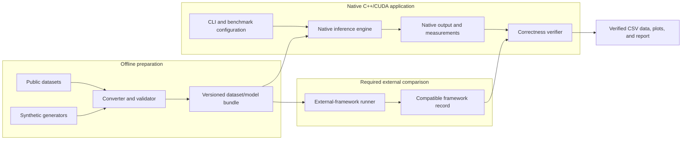
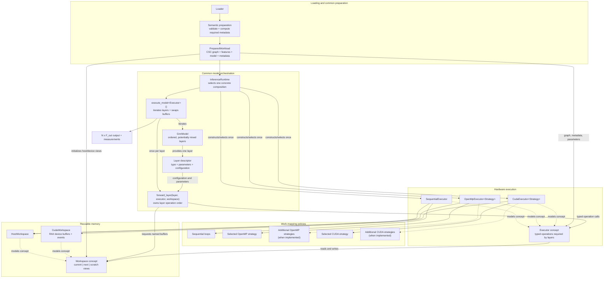

# Native C++/CUDA Architecture
## GNN inference on sequential CPUs, multi-core CPUs, and NVIDIA GPUs

## 1. Purpose

This document defines the target software architecture for the required project in [requirements.md](requirements.md). The selected GNNs, work mappings, and mathematical definitions are specified separately in [semantics.md](semantics.md).

The project is a native, inference-only benchmark application. Its purpose is to run equivalent full-batch workloads for the GNN types selected in [semantics.md](semantics.md) with:

- sequential C++;
- one or more OpenMP work mappings; and
- one or more CUDA work mappings.

The requirements prescribe the minimum implementation counts. The concrete GNN families and selected OpenMP/CUDA mappings come from `semantics.md`; this document explains how those choices fit the reusable component architecture.

The architecture separates layer-specific algorithms, hardware operations, work-mapping strategies, and memory ownership. These pieces are composed with ordinary C++20 templates/concepts and concrete types. The native engine does not require a general deep-learning framework, dependency-injection container, runtime inheritance hierarchy, or Python runtime dependency.

## 2. Scope boundary

### 2.1 Required native path

The measured engine consists of a C++ command-line program, common C++ data types, C++/OpenMP implementations, and CUDA implementations. It loads a graph, features, and fixed model parameters; validates them; runs inference; and emits results.

The core path must not call PyTorch, PyTorch Geometric, DGL, NumPy, or Python to execute a required GNN layer.

### 2.2 External tooling boundary

Dataset download and conversion, experiment sweeps, CSV analysis, and plotting run outside the native inference path. The required established-framework comparison runner is also a separate program. The native command-line interface and versioned files form the supported boundary between these tools and the engine.

Training, automatic differentiation, sampling, graph mutation during a run, distributed execution, and multi-GPU execution are also outside this architecture.

## 3. System context and data flow

This first diagram treats the native engine as one system. It shows where data originates, which work is outside the measured native program, and how native and external results meet. It intentionally hides C++ component details; those appear in Section 4.



The bundle is the interoperability boundary. The native executable and external-framework runner consume equivalent topology, features, parameters, and model configuration, but they are separate programs. Offline conversion and framework execution are not dependencies of the native inference engine.

## 4. Native engine composition

This section is the normative home for model/layer orchestration, executor and strategy responsibilities, workspace ownership, and their extension boundaries. The next diagram opens the `Native inference engine` box and combines component relationships with control and data flow. Boxes labelled “concept” are compile-time requirements, not base classes and not runtime objects.



The principal composition is:

```text
execute_model<ConcreteExecutor>(model, executor, workspace)
    -> forward_layer(concrete_layer, executor, workspace)
        -> executor operations
            -> selected work-mapping strategy
                -> host or CUDA workspace
```

The arrows do not mean that one monolithic executor owns the model algorithm. `execute_model` owns model iteration. `forward_layer` owns the instructions and operation order for a specific layer type. The executor implements those operations for a hardware family. Its strategy decides how the work is partitioned or which kernel variant is launched. The workspace owns reusable memory.

### 4.1 Why the layer does not return a pipeline

A layer is a small parameter/configuration value. The corresponding `forward_layer` overload is its executable algorithm:

```cpp
template <class Executor>
void forward_layer(const GCNLayer& layer,
                   Executor& executor,
                   typename Executor::Workspace& workspace) {
    executor.linear(workspace.current(), layer.weights(), workspace.transformed());
    executor.normalized_aggregate(workspace.transformed(), workspace.next());
    executor.bias_and_activate(workspace.next(), layer.bias(), layer.activation());
}
```

This typed C++ control flow is the pipeline. The layer does not allocate and return a command list, graph, or type-erased pipeline object. Avoiding such an intermediate object preserves compile-time checking and lets CUDA executor calls enqueue kernels without adding per-operation runtime dispatch.

Every supported layer type receives a `forward_layer` overload describing its operation sequence. A model may therefore contain, for example, `GCN -> GraphSAGE -> GCN`, provided adjacent feature dimensions match and the selected executor supports every layer.

The architecture does not require one particular heterogeneous storage mechanism. A closed set of layer types may use `std::variant`; another type-safe layer-boundary dispatch mechanism is also valid. Dispatch occurs at most once per graph-wide layer. No visit, virtual call, or string lookup occurs inside node, edge, or feature loops.

### 4.2 Responsibility summary

| Component | Owns | Does not own |
| --- | --- | --- |
| `PreparedWorkload` | Validated graph, input features, fixed model, and prepared semantic metadata | Execution buffers or hardware policy |
| `GnnModel` / layer descriptors | Ordered layer types, parameters, dimensions, and configuration | CPU threads, CUDA launches, scratch allocation |
| `execute_model` | Layer iteration and current/next buffer swapping | Layer-specific mathematics or work mapping |
| `forward_layer` | Instructions and operation order for that layer type | Hardware loops, kernel launches, buffer ownership |
| `Executor` | Hardware implementation of typed operations, error/synchronization hooks | Model/layer semantics or strategy selection policy |
| `Strategy` | Vertex/edge/feature partitioning and concrete kernel/loop mapping | Layer sequence or parameter ownership |
| `Workspace` | Reusable host/device current, next, transformed, and scratch storage | Mathematical decisions |
| `InferenceRuntime` | One outer selection and construction of a compatible executor/strategy/workspace composition | Per-node, per-edge, or per-feature dispatch |

## 5. Preparation and selection terminology

The high-level diagram retains three concise labels. In this architecture they have precise, limited meanings:

| Label | Exact responsibility |
| --- | --- |
| Semantic preparation | Validate topology/model compatibility and compute immutable common or layer-specific metadata. For GCN this includes degrees, inverse square roots, self-loop flags, and message counts. It does not execute layers. |
| Prepared workload | Immutable validated host-side graph, features, model, and metadata. It does not contain a polymorphic backend. |
| Strategy dispatch | The runtime's single outer selection of a compatible concrete executor, strategy, and workspace. It is not repeated inside inference loops. |

CUDA allocation/upload and host workspace reservation happen after this selection when the concrete workspace is constructed. They are execution setup, not semantic preparation.

## 6. Shared native data contract

All executor compositions consume logically identical graph, feature, and model values. The common C++ layer owns these values and performs validation once before execution.

### 6.1 Graph

The canonical required representation is incoming-neighbor CSC:

- `N` nodes have contiguous IDs in `[0, N)`;
- `col_ptr` has `N + 1` entries;
- the incoming sources for destination `v` are stored in `row_ind[col_ptr[v]..col_ptr[v+1])`;
- an optional scalar weight array is aligned one-to-one with `row_ind`;
- absent weights mean weight `1.0f`, while stored weights are finite and strictly positive;
- source IDs inside a column are sorted; and
- duplicate ordered pairs are rejected unless a documented converter rule combines them before loading.

The graph is immutable during an inference run. CSC is used because the sequential and vertex-centric paths pull all incoming messages for one destination and can own that destination's output row without synchronization.

Supporting both directed and undirected orientations is optional. One clearly documented orientation is sufficient for the required project. If both are supported, one CSC graph class with orientation metadata is sufficient because storage and incoming-neighbor traversal are identical; the undirected case adds reciprocal-edge validation rather than a second graph hierarchy. Regardless of orientation, an adjacency entry always means `source -> destination`.

### 6.2 Dense matrices

Node features, intermediate features, weights, biases, and outputs use `float32`. Dense node and parameter matrices use row-major storage:

```text
element(row, column) = data[row * number_of_columns + column]
```

The input feature matrix has shape `N x F_in`. Layer `l` owns the parameter matrix or matrices required by its semantic contract, each with input/output dimensions compatible with `F_l` and `F_(l+1)`, plus an optional bias of length `F_(l+1)`. The final result has shape `N x F_out`.

Owning host containers may expose small non-owning views (`pointer + shape`) to kernels or tight loops. Views never outlive their owner.

### 6.3 Generic model and mixed layers

`GnnModel` is an ordered, non-empty collection of layer descriptors. Layers may all have the same type or may be mixed. Each descriptor contains the fixed parameters and configuration required by its layer algorithm, including its input and output dimensions.

For example, each `GCNLayer` contains:

- input and output dimensions;
- weight matrix;
- optional bias; and
- activation (`NONE` or `RELU`).

Each mean `GraphSageLayer` similarly contains its input/output dimensions, separate self and neighbor weight matrices, optional bias, and activation.

A mixed model such as `GCN -> GraphSAGE -> GCN` is structurally valid when:

- every layer type has a corresponding `forward_layer` algorithm;
- the output dimension of layer `l` equals the input dimension of layer `l + 1`;
- the graph contains any data required by every layer, such as edge features for an edge-aware layer;
- the selected executor models every capability required by those algorithms; and
- the selected strategies support the operations used by every layer.

Compatibility is checked before workspace allocation or inference. An unsupported layer/executor combination produces a diagnostic rather than failing during a layer.

The selected model types are GCN and mean-aggregator GraphSAGE, as recorded in `semantics.md`. Both execute through the sequential, OpenMP, and CUDA executor families. One complete selected OpenMP mapping and one complete selected CUDA mapping are sufficient for the minimum requirement; additional mappings may reuse the same executor and layer boundaries. The generic model boundary permits mixed layers without making mixed execution mandatory.

### 6.4 Prepared semantic metadata

Before a run, common code validates the graph/model and computes immutable values required by the model's layer algorithms. For GCN layers these values include:

- weighted incoming degree including the effective self-loop policy;
- `1 / sqrt(degree)` for each node;
- whether each node already has an explicit self-loop; and
- stored-edge and effective-message counts used for validation and throughput.

For mean GraphSAGE, prepared metadata may include the total non-self incoming weight per destination and explicit identification of self entries that must be excluded from the neighbor mean.

Other layer types may define additional immutable metadata preparation. Such preparation belongs beside that layer's semantic definition and is shared by all executors implementing the layer. It must not allocate executor work buffers or choose a parallel mapping.

This validation and derivation step is what the diagrams call **semantic preparation**. It is computed once per graph/model configuration, not once per layer repetition. The exact GCN and GraphSAGE aggregation and self-node rules come from [semantics.md](semantics.md); executors and strategies may not reinterpret them.

### 6.5 Logical input and output

The architecture uses simple value records rather than a large runtime object graph. The following names are illustrative; their responsibilities are normative:

```cpp
struct PreparedWorkload {
    CscGraph graph;
    DenseMatrix<float> node_features;
    GnnModel model;
    PreparedMetadata metadata;
};

struct RunOptions {
    BackendId backend;
    StrategyId strategy;
    int threads;
    int warmups;
    int repetitions;
};

struct RunResult {
    DenseMatrix<float> output;
    Measurements measurements;
};
```

This sketch is a responsibility map, not a requirement to use these exact names or place every field in one struct.

## 7. Native program lifecycle

The executable follows a visible, testable sequence:

1. Parse CLI/configuration arguments.
2. Load graph topology, node features, layer parameters, and model configuration.
3. Validate file structure, indices, dimensions, and model compatibility.
4. Compute the shared and layer-specific semantic metadata required by the model.
5. Select one compatible executor, strategy, and workspace composition.
6. Construct the reusable workspace; CUDA also allocates device buffers and uploads immutable and input data.
7. Perform warm-up runs.
8. Perform repeated timed inference runs.
9. For CUDA, download the final output when required.
10. Compare the output with the sequential result.
11. Emit diagnostics and a machine-readable benchmark record.

Conversion from public/framework formats happens before step 1 and is never included in native inference timing.

### 7.1 Timing boundaries

At minimum, results distinguish:

| Measurement | Includes |
| --- | --- |
| Load/setup | File I/O, validation, metadata computation, allocation, and initial transfers |
| Compute | Only the repeated multi-layer forward pass; CUDA uses events and synchronization |
| End-to-end inference | Executor/workspace setup and transfers needed for a run, forward pass, and output retrieval; exact boundary recorded |

The benchmark runner must state whether setup is included rather than hiding it behind a generic `run` duration.

## 8. Multi-layer model execution

`execute_model` iterates through the generic model and invokes the correct layer-specific `forward_layer` algorithm through the selected type-safe layer-boundary mechanism. Each overload invokes typed executor operations but remains the owner of that layer's algorithm.

### 8.1 GCN layer execution

For GCN, `forward_layer` expresses the operation defined in [semantics.md](semantics.md): normalized message aggregation, dense linear transformation, optional bias, and activation.

Either of these mathematically equivalent orders is allowed:

- transform features, then aggregate; or
- aggregate features, then transform.

The chosen order is a compile-time or setup-time execution-policy property exposed to `forward_layer`. The layer function selects the appropriate valid sequence; it is not replaced by an executor-owned GCN implementation. The chosen order is recorded in benchmark metadata because it changes work and memory traffic when `F_in != F_out`.

### 8.2 GraphSAGE layer execution

For mean GraphSAGE, `forward_layer` requests:

1. a weighted mean of non-self incoming neighbors, producing zero for an empty neighbor set;
2. a neighbor-branch linear transformation;
3. a separate self-branch linear transformation of the current node representation;
4. combination of the two branches; and
5. optional bias followed by activation.

The neighbor mean and neighbor linear transformation may be associated in either valid order. Stored self-loop entries are excluded from the neighbor mean, and GraphSAGE does not request GCN's implicit self-loop contribution. Executors expose the required typed operations; these semantic decisions remain in the GraphSAGE `forward_layer` algorithm.

### 8.3 Workspace use

Two reusable feature buffers hold the current and next layer matrices. Their roles swap after each layer. Each layer algorithm declares its scratch requirements without defining hardware allocation. The workspace reserves capacity for the maximum compatible requirements across the complete model before timed repetitions.

There must be no full feature-matrix allocation, graph conversion, model reconstruction, or host/device round trip between layers in a timed steady-state run.

## 9. Concrete executor and strategy compositions

### 9.1 Sequential C++ baseline

`SequentialExecutor` models the required executor operations with ordinary single-threaded loops. `forward_layer` still chooses their order, and `execute_model` still owns the layer loop and buffer swaps. The sequential aggregation operation is intentionally direct and readable:

1. iterate destination nodes;
2. traverse each destination's CSC column;
3. accumulate normalized incoming messages;
4. add an implicit self message only when an explicit one is absent.

The executor's linear and bias/activation operations use similarly direct loops. For GraphSAGE, the sequential aggregation excludes self entries, computes the weighted mean or zero vector, and combines separate self and neighbor transforms. The corresponding sequential result for each GNN type is its native numerical baseline. Every OpenMP and CUDA result is checked against the matching baseline.

### 9.2 Selected OpenMP destination-owned path

`OpenMpExecutor<OmpDestinationStrategy>` uses the common layer algorithm and host workspace for both selected GNN types. Its aggregation strategy distributes destination nodes. A worker owns the aggregate/output row for each assigned destination, so aggregation needs no atomics. The implementation records thread count, scheduling policy, and chunk size.

Static scheduling has low overhead; dynamic or guided scheduling may better handle skewed degrees. Their effect must be measured rather than assumed.

### 9.3 Optional additional OpenMP mappings

The selected destination-owned mapping satisfies the minimum multi-threaded implementation count. Additional mappings are permitted. For example, `OpenMpExecutor<OmpEdgeStrategy>` could distribute ranges of the flattened stored-edge array independently of CSC column boundaries. Multiple workers could then contribute to the same destination, requiring a correct mechanism such as atomics or a staged/thread-local reduction.

In such an additional edge mapping, missing implicit self messages would be added in a separate node-parallel pass. Dense transform and activation operations could be shared with the selected composition. If reported as edge-centric, ranges cannot simply be complete destination columns under a different name.

### 9.4 CUDA memory and execution

`CudaWorkspace` uses owning RAII device buffers and small trivially copyable device views. CUDA executor/workspace setup:

- allocates device arrays for CSC, metadata, features, parameters, intermediates, and output;
- uploads immutable graph/model data once;
- uploads the input feature matrix before execution; and
- creates reusable workspace and timing events.

`forward_layer` calls `CudaExecutor` operations in semantic order; those operations enqueue the selected kernels. All layers execute device-resident, while `execute_model` swaps device-buffer roles between layers. Only the final output is downloaded for verification or consumption. CUDA allocation, copies, kernel launches, event operations, and synchronization are checked and reported with context.

### 9.5 Selected CUDA destination/feature path

`CudaExecutor<CudaDestinationFeatureStrategy>` assigns destination/feature aggregation work so each output element or row has a single logical owner. It traverses CSC incoming edges and therefore avoids atomic aggregation. The strategy can serve both GCN normalized aggregation and GraphSAGE weighted-mean aggregation while their different rules remain in their layer algorithms. A practical mapping is a two-dimensional launch over destinations and feature tiles; the final launch geometry is a measured choice, not an architectural abstraction.

### 9.6 Optional additional CUDA mappings

The selected destination/feature mapping satisfies the minimum CUDA implementation count. Additional CUDA strategies are permitted. Examples include:

- edge-centric aggregation using atomic or staged reduction;
- a different mapping across feature dimensions;
- a coalesced/transposed feature layout; or
- message-passing tiling with justified shared-memory reuse.

“Use shared memory” is not itself a complete work-mapping description. Every implemented configuration must state what data is reused, by which threads, and why the extra synchronization/storage should help. Under `BEN-COMP-08`, a controlled shared-memory configuration is evaluated when applicable; it need not constitute a separate end-to-end work mapping. When no useful reuse or cooperative operation exists, the report records why shared memory is not applicable.

## 10. Compile-time composition and outer selection

`Executor` and `Workspace` are C++20 concepts (or equivalently documented template requirements). Concrete types model those concepts without inheriting from a runtime base class. `forward_layer` calls them statically, allowing the compiler to inline host operations and leaving CUDA kernel launches as ordinary typed calls.

The CLI still needs runtime selection so one executable can benchmark every required configuration. That selection occurs once and maps to a concrete template instantiation:

```cpp
template <class Executor>
RunResult run_composition(const PreparedWorkload& workload,
                          const RunOptions& options) {
    Executor executor{workload, options};
    typename Executor::Workspace workspace{workload, options};
    return execute_model(workload.model, executor, workspace, options);
}

switch (options.backend) {
case BackendId::Sequential:
    return run_composition<SequentialExecutor>(workload, options);

case BackendId::OpenMp:
    return run_composition<
        OpenMpExecutor<OmpDestinationStrategy>>(workload, options);

case BackendId::Cuda:
    return run_composition<
        CudaExecutor<CudaDestinationFeatureStrategy>>(workload, options);
}
```

The example shows the selected profile from `semantics.md`. If additional work mappings are implemented, they add outer dispatch cases without changing `execute_model` or `forward_layer`. The real implementation must validate unsupported combinations and return a diagnostic. The example's important property is that selection produces a complete compatible composition before `execute_model` begins. There are no backend switches, virtual calls, string comparisons, or factory lookups inside layer operations or node/edge/feature loops.

The executor concept should expose only operations required by selected layer algorithms. It is not a monolithic `run_model()` interface, because that would move layer logic into the executor. It is also not necessarily a broad universal tensor API. GCN needs operations such as `linear`, `normalized_aggregate`, and `bias_and_activate`; GraphSAGE additionally needs a non-self weighted mean and branch combination/linear-add operation. Other layer overloads may require additional well-defined executor capabilities.

## 11. Ownership and module boundaries

The target source layout should make dependencies point from the application and concrete executors toward common contracts and layer algorithms:

```text
src/
  common/
    graph/          owning CSC and validation
    matrix/         owning matrices and non-owning host views
    gnn/            generic model, layer descriptors/algorithms, metadata rules
    execution/      executor/workspace concepts and execute_model
    io/             native bundle/configuration loading
    verify/         tolerance-based output comparison
    benchmark/      options, measurements, CSV records
  sequential/       sequential executor, strategy, host workspace
  parallel/         OpenMP executor and selected/additional strategies
  cuda/             CUDA executor, strategies, workspace, views, kernels
  app/              CLI, InferenceRuntime, outer composition switch
tools/              offline converters, generators, sweeps, plots, framework runner
tests/              unit, semantic, backend, and malformed-input tests
```

The exact folders can be introduced incrementally. The important rules are:

- `common` contains layer algorithms but no OpenMP scheduling or CUDA ownership;
- CPU executors do not include CUDA headers;
- CUDA kernels receive non-owning views, not host containers;
- file loaders do not silently modify graph semantics; and
- the CLI/runtime selects and coordinates components but does not implement layer mathematics.

## 12. Validation and failure behavior

Validation occurs before unchecked high-performance access. It covers:

- CSC pointer size, starting value, monotonicity, and final edge count;
- source index range, sorted columns, edge-weight count, and duplicates;
- finite, strictly positive stored edge weights required by the selected normalization;
- feature row count and feature/model dimensions;
- non-empty model and compatible consecutive layers;
- graph data and executor capabilities required by every layer type;
- valid executor/strategy/workspace combinations; and
- capacity/overflow checks before allocation.

Invalid input produces a diagnostic and non-zero process exit. Executor errors identify the failed operation. A failed correctness comparison prevents a result from being presented as numerically equivalent.

## 13. Correctness architecture

Correctness has three levels:

1. small hand-calculated fixtures test graph orientation and both required layer types; GCN fixtures include normalization and self-loops, while GraphSAGE fixtures include non-self weighted mean, empty neighborhoods, and separate self/neighbor branches;
2. the sequential executor produces the native reference for complete one-layer and multi-layer GCN/GraphSAGE workloads, plus supported mixed-layer workloads; and
3. every implemented OpenMP/CUDA strategy is compared element-wise using the absolute/relative tolerance from [semantics.md](semantics.md).

Tests include non-uniform degree, an isolated node, explicit and missing self-loops, invalid dimensions, and malformed CSC. The required external-framework mappings for GCN and GraphSAGE are checked against the same sequential baselines before their performance measurements are accepted.

## 14. Benchmark and reproducibility architecture

One native benchmark CLI accepts dataset/model paths, backend, strategy, thread/launch configuration, warm-ups, repetitions, and output path. Every CSV row records enough information to reproduce the run:

- dataset and model identifiers;
- node, stored-edge, and per-layer processed-message counts;
- feature dimensions and layer count;
- backend and strategy;
- threads or CUDA launch settings;
- timing scope and sample statistics;
- throughput and speedup;
- host/device peak-memory method and result;
- verification status and tolerances; and
- compiler, CUDA/runtime, hardware, OS, and source revision.

The experiment layer records a controlled shared-memory comparison when applicable and compares sparse with feasible dense adjacency storage. Dense comparisons include the represented storage and executed-work counts so small dense baselines are not extrapolated misleadingly to large graphs.

The dataset plan selects at least one of the scale-free, random, or small-world synthetic families and at least one public graph. Synthetic and public configurations are both constrained by available host and device memory. When a larger case is omitted, the report identifies the limiting resource and justifies the largest feasible configuration.

The final technical documentation records how many complete CPU and CUDA mappings were implemented, why that number was chosen, why each mapping fits the selected workloads and hardware, which alternatives were considered, and how measurements affected the original rationale.

The required external-framework runner consumes equivalent saved GCN and GraphSAGE data and emits compatible result fields. It remains a separate program so framework startup, caching, and synchronization choices are visible.
