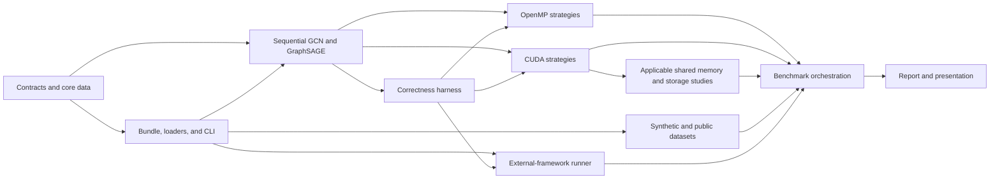

# Implementation Features and Tasks
## Native GCN and GraphSAGE inference on CPUs and NVIDIA GPUs

## 1. Purpose

This document turns [requirements.md](requirements.md), [architecture.md](architecture.md), and [semantics.md](semantics.md) into an ordered implementation backlog. It defines work packages and acceptance conditions; mathematical and software contracts remain authoritative in those linked documents.

Each task is complete only when its acceptance condition is demonstrated by code, an automated test, a reproducible command, or an experiment artifact as appropriate.

## 2. Required product scope

The implementation includes:

- a native C++20/CUDA full-batch inference engine;
- directed and undirected canonical CSC graphs, identified by a graph-orientation enum and exposed through the same layer-facing neighbor interface;
- GCN and mean-aggregator GraphSAGE models with one or more layers;
- sequential CPU execution for both model types;
- at least one complete OpenMP implementation capable of executing both selected model types;
- at least one complete CUDA implementation capable of executing both selected model types;
- the selected destination-owned OpenMP and destination/feature CUDA mappings defined in `semantics.md`;
- an applicable shared-memory study and a sparse/dense study;
- synthetic and public datasets;
- correctness verification against the matching native sequential baseline; and
- comparison with at least one established external GNN framework for both model types.

Additional OpenMP or CUDA work mappings are conditional extensions. If the selected profile in `semantics.md` changes, the corresponding implementation tasks and rationale change with it; the minimum remains one or more complete implementations for each parallel backend.

The external-framework runner is a separate program that exchanges versioned data and result files with the native engine. It is not linked into or embedded in the native inference path.

Model training and weight updates, automatic differentiation and backpropagation, mini-batch execution or neighbor sampling, and distributed or multi-GPU execution are out of scope, as specified by `requirements.md`. A third GNN architecture and mixed GCN/GraphSAGE model execution remain optional.

## 3. Implementation rules

- `semantics.md` is the single contract for the selected GNNs, their mathematics, and the selected CPU/CUDA mappings.
- Graph orientation is data metadata, represented by a simple enum. Directed and undirected graphs use the same canonical CSC traversal contract, so GCN and GraphSAGE layer definitions do not branch on orientation; undirected inputs add reciprocal-edge validation at loading time.
- A layer descriptor owns fixed parameters and configuration.
- A layer-specific `forward_layer` function defines the operation sequence.
- An executor implements typed operations for sequential C++, OpenMP, or CUDA.
- A strategy maps operation work over nodes, edges, features, or CUDA thread groups.
- A workspace owns reusable host or device buffers.
- Backend and strategy dispatch occurs before performance-critical node, edge, and feature loops.
- Timed steady-state inference performs no file conversion, model reconstruction, full-matrix allocation, or intermediate host/device round trip.

## 4. Delivery milestones

| Milestone | Acceptance boundary |
| --- | --- |
| M0 — contracts | Native bundle, graph convention, GCN/GraphSAGE parameters, CLI, and result schema are documented and covered by format tests. |
| M1 — sequential reference | One-layer and multi-layer GCN and GraphSAGE models load, execute sequentially, and pass hand-calculated fixtures. |
| M2 — multi-core CPU | Both selected model types pass the selected complete OpenMP implementation and its strategy rationale is documented. |
| M3 — CUDA baseline | Both selected model types run device-resident through the selected complete CUDA implementation and match their sequential baselines. |
| M4 — CUDA experiments | The applicable shared-memory comparison is reproducible; any additional work mapping is verified and documented. |
| M5 — datasets and framework | Synthetic/public workloads and equivalent external-framework GCN/GraphSAGE runs pass semantic checks. |
| M6 — evaluation | All required timing, throughput, memory, scalability, strategy, storage, and framework comparisons are exported. |
| M7 — delivery | Build/run documentation, technical report, reproducibility artifacts, and presentation are complete. |

## 5. Dependency flow

## 6. Feature map

| Feature | Outcome |
| --- | --- |
| F-CONTRACTS | Validated graph, matrix, model, semantic metadata, executor, and workspace contracts. |
| F-IO | Reproducible native bundle loading, configuration, diagnostics, and result output. |
| F-SEQ | Complete sequential GCN and GraphSAGE baselines. |
| F-VERIFY | Semantic fixtures and cross-executor numerical verification. |
| F-OMP-SELECTED | Selected destination-owned OpenMP execution for GCN and GraphSAGE. |
| F-OMP-ADDITIONAL | Conditional additional OpenMP mapping when added to `semantics.md`. |
| F-CUDA-CORE | CUDA ownership, transfers, launch/error handling, and device workspaces. |
| F-CUDA-SELECTED | Device-resident destination/feature CUDA execution for GCN and GraphSAGE. |
| F-CUDA-ADDITIONAL | Conditional additional CUDA mapping when added to `semantics.md`. |
| F-EXPERIMENTS | Applicable shared-memory and sparse/dense studies. |
| F-DATA | Reproducible synthetic graphs and at least one public benchmark. |
| F-FRAMEWORK | Equivalent GCN and GraphSAGE comparison in an established framework. |
| F-BENCH | Repeatable timing, throughput, memory, scaling, and CSV orchestration. |
| F-DELIVERY | Build/run guide, format guide, report artifacts, and slides. |

### 6.1 Three-person delivery split

The work is divided into one shared-infrastructure stream and two vertical model streams. This prevents one person from receiving all CUDA work: every member implements parallel code, while the GCN and GraphSAGE owners each take their model through sequential, OpenMP, and CUDA execution.

| Owner | Five primary work packages | Parallel implementation responsibility |
| --- | --- | --- |
| `s360540` | Shared contracts and I/O; model-independent sequential runtime; shared OpenMP primitives; CUDA infrastructure and shared CUDA primitives; verification/build infrastructure | OpenMP dense and elementwise operations; reusable host workspace; CUDA buffers, error/timing wrappers, workspace, dense, bias, activation, and branch-combination operations |
| `s362415` | GCN sequential path; GCN OpenMP path; GCN CUDA path; synthetic data and GCN framework mapping; OpenMP scaling and GCN report results | GCN destination-owned OpenMP aggregation and GCN destination/feature CUDA aggregation |
| `s296248` | GraphSAGE sequential path; GraphSAGE OpenMP path; GraphSAGE CUDA path; public data and GraphSAGE framework mapping; CUDA experiments and GraphSAGE report results | GraphSAGE destination-owned OpenMP mean aggregation and GraphSAGE destination/feature CUDA mean aggregation |

Tasks that mention both models are split by model rather than silently assigned to one backend owner. For example, the GCN portion of T-SEQ-04, T-VER-04, and T-VER-06 belongs to `s362415`; the GraphSAGE portion belongs to `s296248`. Shared primitives and integration remain with `s360540`.

#### Detailed ownership and hand-offs

| Area | `s360540` — shared foundation | `s362415` — GCN vertical slice | `s296248` — GraphSAGE vertical slice |
| --- | --- | --- | --- |
| Contracts and I/O | T-CON-01 through T-CON-04, T-CON-06 through T-CON-08, T-IO-01, and T-IO-03 through T-IO-06 | T-IO-02 graph loader; GCN preparation in T-CON-05 | GraphSAGE preparation in T-CON-05 |
| Sequential | T-SEQ-01, T-SEQ-05, and T-SEQ-06 | T-SEQ-02 and the GCN part of T-SEQ-04 | T-SEQ-03 and the GraphSAGE part of T-SEQ-04 |
| OpenMP | T-OMPV-03 and T-OMPV-05; integrates the common executor | T-OMPV-01 and GCN configuration/results for T-OMPV-04 | T-OMPV-02 and GraphSAGE configuration/results for T-OMPV-04 |
| CUDA | T-CUDA-01 through T-CUDA-04 and T-CUDAV-03; integrates the common executor and upload/residency path | T-CUDAV-01 and GCN launch results for T-CUDAV-04 | T-CUDAV-02 and GraphSAGE launch results for T-CUDAV-04 |
| Verification | T-VER-03 and T-VER-05; owns the common comparison harness | T-VER-01 and the GCN parts of T-VER-04 and T-VER-06 | T-VER-02 and the GraphSAGE parts of T-VER-04 and T-VER-06 |
| Data and framework | T-FRM-01, T-FRM-02, and T-FRM-05; owns the shared adapter and result-schema integration | T-DATA-01, T-DATA-02, the GCN portions of T-DATA-04/T-DATA-05, T-FRM-03, and the GCN portion of T-FRM-06 | T-DATA-03, the GraphSAGE portions of T-DATA-04/T-DATA-05, T-FRM-04, and the GraphSAGE portion of T-FRM-06 |
| Evaluation and delivery | T-BENCH-01, T-BENCH-02, T-BENCH-07, T-DEL-01, and T-DEL-02; owns the common benchmark runner and metadata export | OpenMP portions of T-BENCH-03 through T-BENCH-06 and the GCN portions of T-DEL-03/T-DEL-04 | F-EXPERIMENTS, CUDA portions of T-BENCH-03 through T-BENCH-06, GraphSAGE portions of T-DEL-03/T-DEL-04, and T-DEL-05 |

The shared interfaces are agreed first, after which the two model owners can implement OpenMP and CUDA paths in parallel. A model path is complete only when it passes the common sequential comparison; each model owner reviews the other owner's parallel path to reduce backend-specific silos.

F-OMP-ADDITIONAL and F-CUDA-ADDITIONAL remain stretch work. If time permits after both required model paths pass verification, `s362415` leads the additional OpenMP mapping and `s296248` leads the additional CUDA mapping, with `s360540` handling shared integration. Optional strategies are not allowed to delay the required GCN or GraphSAGE paths.

## 7. F-CONTRACTS — shared native contracts

| Task | Work | Done when |
| --- | --- | --- |
| T-CON-01 | Define the canonical CSC graph with a directed/undirected orientation enum, sorted source indices, optional positive scalar weights, and explicit-self-loop preservation. Keep orientation outside layer semantics. | Directed and undirected fixtures expose the same layer-facing traversal contract; the enum round-trips through metadata, undirected reciprocity is validated, and malformed pointers, indices, duplicates, asymmetry, or invalid weights are rejected. |
| T-CON-02 | Define owning row-major `float32` matrices and bounded non-owning host/device views. | Shape, offset, overflow, move, and lifetime tests pass without per-row heap allocations. |
| T-CON-03 | Define `GCNLayer` and mean `GraphSageLayer` descriptors with dimensions, parameters, optional bias, and activation. | Valid one-layer and multi-layer descriptors are constructible and incompatible parameter shapes are rejected. |
| T-CON-04 | Define a non-empty generic model and a type-safe layer-selection boundary. | Homogeneous GCN and GraphSAGE models validate; unsupported types and adjacent-dimension mismatches fail before inference. |
| T-CON-05 | Implement shared semantic preparation for GCN degrees/self messages and GraphSAGE non-self neighbor-weight totals. | Prepared values match hand-calculated weighted, explicit-self, missing-self, and empty-neighbor fixtures. |
| T-CON-06 | Define executor operation requirements and layer-specific `forward_layer` algorithms. | GCN and GraphSAGE operation order is expressed outside executor classes and unsupported executor capabilities are diagnosed before execution. |
| T-CON-07 | Define reusable host and CUDA workspace contracts, including ping-pong features and layer scratch requirements. | Maximum required capacity is established before timed repetitions and buffer roles swap safely across layers. |
| T-CON-08 | Define outer backend/strategy dispatch to concrete compositions. | No backend switch, virtual dispatch, string lookup, or factory lookup occurs in a node/edge/feature loop. |

## 8. F-IO — bundle, loaders, and CLI

| Task | Work | Done when |
| --- | --- | --- |
| T-IO-01 | Specify a versioned workload bundle for CSC arrays, weights, node features, model layers/parameters, dtype, layout, orientation, byte order, index width, and provenance. | A minimal GCN bundle and a minimal GraphSAGE bundle can be produced and loaded using only the format specification. |
| T-IO-02 | Implement the strict canonical CSC graph loader, including orientation-enum decoding and directed/undirected validation. | Directed and undirected fixtures load with the correct enum; truncated arrays, inconsistent counts, invalid enum values, duplicates, and asymmetric undirected inputs produce contextual diagnostics. |
| T-IO-03 | Implement strict node-feature, model, layer, and parameter loaders. | Truncated data, incompatible dimensions, invalid layer configuration, and arithmetic overflow produce contextual diagnostics. |
| T-IO-04 | Implement CLI/configuration fields for dataset/model paths, backend, strategy, threads/launch settings, warm-ups, repetitions, verification, and output path. | A non-default configuration is reproduced from one recorded command. |
| T-IO-05 | Define a machine-readable result schema shared by native and framework runners. | CSV records distinguish setup, compute, and end-to-end boundaries and include all metadata required by `requirements.md`. |
| T-IO-06 | Make unsupported model/backend/strategy combinations fail before workspace allocation or timing. | Negative configuration tests return a non-zero exit and name the incompatible selection. |

## 9. F-SEQ — sequential baselines

| Task | Work | Done when |
| --- | --- | --- |
| T-SEQ-01 | Implement direct single-threaded dense linear, bias, activation, and branch-combination operations. | Small matrix fixtures match hand-calculated results. |
| T-SEQ-02 | Implement GCN normalized incoming aggregation with explicit-or-implicit self handling. | Weighted and unweighted fixtures match the equations in `semantics.md`. |
| T-SEQ-03 | Implement GraphSAGE weighted non-self mean with a zero vector for an empty neighborhood. | Self-loop exclusion, weighted mean, and empty-neighbor fixtures pass. |
| T-SEQ-04 | Implement GCN and GraphSAGE `forward_layer` algorithms using the shared sequential executor operations. | One layer of each type matches its worked semantic example. |
| T-SEQ-05 | Implement `execute_model` with layer iteration and ping-pong feature buffers. | One-layer and multi-layer GCN and GraphSAGE outputs are correct with differing feature dimensions. |
| T-SEQ-06 | Remove repeated allocations and graph/model reconstruction from the steady-state forward pass. | Allocation instrumentation reports no full feature-matrix allocation during a timed repetition. |

## 10. F-VERIFY — correctness and failure handling

| Task | Work | Done when |
| --- | --- | --- |
| T-VER-01 | Encode independent GCN fixtures for direction, normalization, explicit/missing self-loops, bias, activation, and multiple layers. | Expected values are hand-calculated or generated independently of the native implementation and all fixtures pass sequentially. |
| T-VER-02 | Encode independent GraphSAGE fixtures for non-self weighted mean, empty neighborhoods, separate branches, bias, activation, and multiple layers. | Expected values are independent and all fixtures pass sequentially. |
| T-VER-03 | Implement shape-aware absolute/relative tolerance comparison with NaN/infinity handling. | Boundary-value tests for `atol`, `rtol`, shape mismatch, NaN, and infinity pass. |
| T-VER-04 | Compare every required or equivalence-claimed OpenMP/CUDA result with the matching per-type sequential baseline. | An intentionally corrupted result is rejected and cannot be reported as equivalent. |
| T-VER-05 | Add malformed-input and unsupported-composition tests. | Invalid CSC, weights, dimensions, layer data, and strategy combinations fail deterministically with diagnostics. |
| T-VER-06 | Compare external-framework GCN and GraphSAGE outputs with their native sequential baselines. | Framework performance records are accepted only after the associated semantic checks pass. |

## 11. F-OMP-SELECTED — destination-owned OpenMP

| Task | Work | Done when |
| --- | --- | --- |
| T-OMPV-01 | Implement destination-parallel GCN aggregation over complete CSC columns. | Each destination row has one owner, needs no aggregation atomic, and matches sequential GCN. |
| T-OMPV-02 | Implement destination-parallel GraphSAGE non-self mean using the same work-mapping family. | Weighted, self-loop, and empty-neighbor cases match sequential GraphSAGE. |
| T-OMPV-03 | Parallelize compatible dense and elementwise operations without changing layer semantics. | Complete multi-layer GCN and GraphSAGE models pass verification. |
| T-OMPV-04 | Expose thread count, schedule, and chunk size and record the chosen values. | Static and at least one load-balancing configuration can be reproduced on skewed-degree graphs. |
| T-OMPV-05 | Keep intermediate matrices in reusable host workspaces. | No full feature-matrix allocation occurs between layers or timed repetitions. |

## 12. F-OMP-ADDITIONAL — conditional additional OpenMP mapping

This feature is required only if an additional OpenMP mapping is selected in `semantics.md`. The edge-centric tasks below define one possible extension; they do not increase the minimum implementation count.

| Task | Work | Done when |
| --- | --- | --- |
| T-OMPE-01 | Partition the flattened stored-edge range independently of CSC column boundaries. | A high-degree destination's edge range can be split across workers. |
| T-OMPE-02 | Implement correct concurrent accumulation using atomics, private partials plus reduction, or another documented method. | Thread-sanitizer/race checks where available and numerical comparisons show no lost contributions. |
| T-OMPE-03 | Add missing implicit GCN self messages in a separate node-parallel pass. | Explicit and absent self-loop fixtures match the sequential baseline without double counting. |
| T-OMPE-04 | Complete the multi-layer GCN path using shared dense operations and workspace reuse. | The same saved GCN models run through vertex- and edge-centric OpenMP strategies. |
| T-OMPE-05 | Record synchronization, scheduling, and private-buffer memory costs. | Benchmark output is sufficient to explain the performance/load-balance trade-off. |

## 13. F-CUDA-CORE — device ownership and execution

| Task | Work | Done when |
| --- | --- | --- |
| T-CUDA-01 | Implement move-safe RAII device buffers and non-owning kernel views for graph, metadata, matrices, and both layer parameter types. | Repeated allocate/move/free tests and CUDA sanitizers report no invalid ownership or access. |
| T-CUDA-02 | Upload immutable graph/model data once and keep features/intermediates device-resident across layers. | A multi-layer run has no intermediate device-to-host feature transfer. |
| T-CUDA-03 | Implement checked allocation, copy, launch, event, and synchronization wrappers with operation context. | Injected or naturally occurring CUDA failures produce useful diagnostics. |
| T-CUDA-04 | Implement reusable device workspaces and timing events. | Timed repetitions reuse allocations and distinguish device compute from end-to-end time. |

## 14. F-CUDA-SELECTED — CUDA mapping for both GNN types

| Task | Work | Done when |
| --- | --- | --- |
| T-CUDAV-01 | Implement destination/feature-mapped GCN aggregation over CSC with a single logical owner per output element. | GCN fixtures and multi-layer workloads pass without aggregation atomics. |
| T-CUDAV-02 | Implement destination/feature-mapped GraphSAGE non-self weighted mean. | GraphSAGE fixtures and multi-layer workloads match the sequential baseline. |
| T-CUDAV-03 | Implement required dense, branch-combination, bias, and activation CUDA operations. | Complete GCN and GraphSAGE paths remain device-resident and pass verification. |
| T-CUDAV-04 | Make block/grid geometry configurable and record it with results. | At least two valid launch configurations can be reproduced. |

## 15. F-CUDA-ADDITIONAL — conditional additional CUDA mapping

This feature is required only if an additional CUDA work mapping is selected in `semantics.md`. A shared-memory configuration of the selected mapping is covered separately by F-EXPERIMENTS and does not by itself require another end-to-end mapping.

| Task | Work | Done when |
| --- | --- | --- |
| T-CUDAA-01 | Select and document a materially different strategy, such as edge-centric reduction, a different feature mapping, a coalesced layout, or message tiling. | The work assignment or memory-access design is demonstrably different from the selected CUDA mapping. |
| T-CUDAA-02 | Implement correct normalized GCN aggregation for the selected strategy. | One-layer and multi-layer outputs match sequential GCN within tolerance. |
| T-CUDAA-03 | Integrate the strategy through outer composition dispatch and shared layer algorithms. | The strategy requires no backend branch inside `forward_layer` or performance-critical loops. |
| T-CUDAA-04 | Benchmark the additional mapping against the selected CUDA implementation on identical GCN workloads. | Timing, throughput, memory, launch configuration, and numerical verification are recorded. |

## 16. F-EXPERIMENTS — applicable optimization and storage studies

| Task | Work | Done when |
| --- | --- | --- |
| T-EXP-01 | Determine whether the selected CUDA mapping has useful block-local reuse or a cooperative operation suitable for shared memory. | The analysis either identifies the reused values, tile shape, byte budget, and synchronization plan or documents why shared memory is not applicable. |
| T-EXP-02 | When shared memory is applicable, compare the shared-memory configuration with the corresponding non-shared mapping. | Equivalent workloads report performance, resource use, occupancy-relevant data, and verification. |
| T-EXP-03 | Implement a feasible dense-adjacency baseline or calculate its storage/work limits beyond feasible sizes. | The report contains a controlled sparse/dense comparison and a quantitative large-graph infeasibility analysis. |

## 17. F-DATA — synthetic and public workloads

| Task | Work | Done when |
| --- | --- | --- |
| T-DATA-01 | Select and reproducibly generate at least one of the scale-free, Erdos-Renyi, or small-world graph families; additional families are optional. | Repeated generation of the selected family yields identical canonical topology and metadata. |
| T-DATA-02 | Vary node count, feature dimension, and model depth over the required experiment ranges while accounting for CPU and GPU memory. | Saved configurations cover at least one order of magnitude in graph size and multiple feature/depth values; omitted larger sizes and their limiting resource are documented. |
| T-DATA-03 | Convert at least one public node-feature graph to the native bundle. | Source, license/citation, transformations, orientation, self-loop handling, and feature conversion are documented. |
| T-DATA-04 | Generate or import reproducible GCN and GraphSAGE parameters for every workload. | Native and framework runners consume numerically identical parameter values. |
| T-DATA-05 | Record exact stored-entry and per-layer processed-message counts. | Throughput denominators can be reconstructed for GCN and GraphSAGE. |

## 18. F-FRAMEWORK — required external comparison

| Task | Work | Done when |
| --- | --- | --- |
| T-FRM-01 | Select and version at least one established GNN framework and document its execution environment. | The framework, dependencies, device, dtype, and execution mode are reproducible. |
| T-FRM-02 | Implement a standalone adapter for the native bundle and result schema. | The runner loads the same topology, features, layer parameters, and configuration without linking into the native engine. |
| T-FRM-03 | Map GCN orientation, self-loop, normalization, parameter layout, bias, and activation exactly. | Framework GCN output matches native sequential GCN on fixtures and benchmark workloads. |
| T-FRM-04 | Map GraphSAGE non-self mean, empty-neighbor behavior, self/neighbor parameters, bias, and activation exactly. | Framework GraphSAGE output matches native sequential GraphSAGE on fixtures and benchmark workloads. |
| T-FRM-05 | Define framework timing and memory boundaries with warm-up, synchronization, repetitions, and caching/preprocessing policy. | Throughput and peak-memory records can be interpreted beside native records without hidden setup work. |
| T-FRM-06 | Run equivalent native/framework comparisons for both required GNN types. | Final tables include verified GCN and GraphSAGE results for the selected framework and native engine. |

## 19. F-BENCH — orchestration and measurement

| Task | Work | Done when |
| --- | --- | --- |
| T-BENCH-01 | Implement warm-up and repeated measurement with documented central tendency and variability. | Raw samples and summaries are emitted for every configuration. |
| T-BENCH-02 | Separate load/setup, compute, transfer, and end-to-end boundaries. | CPU, CUDA, and framework records state exactly what each timing includes. |
| T-BENCH-03 | Compute nodes/s, stored-edges/s or processed-messages/s, and speedup against the matching sequential model type. | Metric formulas reproduce the exported values. |
| T-BENCH-04 | Measure host and device peak memory with documented methods. | Representative native and framework configurations include reproducible peak-memory values. |
| T-BENCH-05 | Sweep OpenMP thread counts and selected CUDA launch configurations. | Scaling tables/plots include exact thread and launch settings. |
| T-BENCH-06 | Orchestrate required graph-size, feature-size, depth, degree-distribution, selected-implementation, applicable shared-memory, sparse/dense, and framework comparisons; compare additional mappings when present. | Every `BEN-COMP` requirement maps to at least one saved experiment set. |
| T-BENCH-07 | Export commands, seeds, hardware/software metadata, verification outcome, and samples in machine-readable form. | A result row and its referenced configuration are sufficient to rerun the experiment. |

## 20. F-DELIVERY — documentation and presentation

| Task | Work | Done when |
| --- | --- | --- |
| T-DEL-01 | Document supported host/CUDA environments and clean Meson/Ninja build commands. | A clean checkout builds sequential, OpenMP, CUDA, tests, and runner targets in each claimed environment. |
| T-DEL-02 | Document CLI options, bundle schemas, dataset conversion, and example GCN/GraphSAGE commands. | A reader can reproduce one verified run of each required model type. |
| T-DEL-03 | Produce tables and plots for all required comparisons with methodology and negative/neutral-result analysis. | Every plotted value traces to machine-readable records and a saved configuration. |
| T-DEL-04 | Write the technical report covering semantics, architecture, work mappings, memory behavior, skewed degrees, correctness, limitations, and the rationale for the number and choice of CPU/CUDA implementations. | The report addresses every item required by `project.md` and `requirements.md`. |
| T-DEL-05 | Prepare the presentation and a concise demonstration path. | The material fits the assigned presentation time and reproduces representative native and framework results. |

## 21. Optional extensions

Directed and undirected inputs are both part of the selected implementation scope, satisfying `OPT-01` from `requirements.md`. A simple orientation enum distinguishes them in graph metadata; the layer and model definitions are identical for both orientations.

The remaining optional work begins only after the required acceptance boundaries are met:

- `OPT-02`: add a third GNN type with its own semantic contract and backend coverage;
- `OPT-03`: add dense edge-feature vectors or attention-weighted aggregation;
- `OPT-04`: add a final classifier or softmax and report node-classification accuracy; or
- `OPT-05`: execute mixed GCN/GraphSAGE layer sequences.
